# System Inventory Specification

* [Introduction](#Section-0)
* [Section 1. Charter](#Section-1)
* [Section 2. Architecture Overview](#Section-2)
* [Section 3. Design Considerations](#Section-3)
* [Section 4. Implementation Approach](#Section-4)
* [Section 5. Frontend (React)](#Section-5)
    * [Section 5.1. Core Functionality](#Section-5.1)
    * [Section 5.2. UI Elements](#Section-5.2)
    * [Section 5.3. Layout & Structure](#Section-5.3)
    * [Section 5.4. UI Design](#Section-5.4)
    * [Section 5.5. State Management  (**`useState`**, **`useEffect`**)](#Section-5.5)
    * [Section 5.6. Impact & Dependencies on Existing Frontend Components](#Section-5.6)
* [Section 6. Backend (Flask API)](#Section-6)
    * [Section 6.1. Core Functionality](#Section-6.1)
    * [Section 6.2. API Endpoints  (**`routes.py`**)](#Section-6.2)
        * [Section 6.2.1. Phase 1: Core Functionality Endpoints](#Section-6.2.1)
        * [Section 6.2.2. Phase 3: Advanced Features Endpoints](#Section-6.2.2)
    * [Section 6.3. Service Layer  (**`system_inventory_service.py`**)](#Section-6.3)
        * [Section 6.3.1. Phase 1: Core Functionality Service Methods](#Section-6.3.1)
        * [Section 6.3.2. Phase 3: Advanced Features Service Methods](#Section-6.3.2)
    * [Section 6.4. Impact & Dependencies on Existing Backend Components](#Section-6.4)
* [Section 7. Database (MySQL)](#Section-7)
    * [Section 7.1. Database Schema **`models.py`](#Section-7.1)
    * [Section 7.2. Database Relationships](#Section-7.2)
    * [Section 7.3. Data Population](#Section-7.3)
    * [Section 7.4 Impact & Dependencies on Existing Database Components](#Section-7.4)
* [Section 8. Phase 2: Modifications to TODO_Tracker_Specification](#Section-8)
* [Section 9. Implementation Plan](#Section-9)

---

## <h2 id="Section-0"> Introduction</h2>

This specification came about as a result of 3 short sentences in the **`TODO_Tracker_Specification.md`** in relation to colour coding and providing automcomplete suggestions for system entities involved in tasks based on their groups from their respective inventories  (**`_API_Endpoint_Inventory.md`**, **`_Code_File_Inventory.md`**, **`_DB_Table_Inventory.md`**). I realised that this was a much larger problem that needed to be solved in a more structured way, especially as the application grows and evolves.
Currently, the information, in the 3 markdown files mentioned above, is cumbersome to maintain and difficult to use for its intended purpose (e.g. analysing relationships and dependencies, and figuring out what impact a change is going to have on the system).

---

📖 ***Side Story:*** *As with anything I focus on, this specification started as a straightforward, simple feature, but every iteration, I added another table or API endpoint and at one stage I redesigned the entire approach from a "concrete" or "explicit" model (separate tables for API Endpoints, Code Files, DB Tables) to a much more "abstract" or "generic" Entity-Attribute-Value (EAV) or EAV-like model for the inventory_items. This design is now system agnostic, flexible, and scalable... YAY!*

---

* **What's in this specification?**
    This specification will cover what is needed to deliver the objective and goals, outlined in [Section 1. Charter](#Section-1), from the following perspectives:
    * **Architecture Overview**: A high-level overview of the architecture.
    * **Design Considerations**: Including technologies and implementation approach.
    * **Frontend (React)**: The user interface components, UI elements, design and layout, state management and impact & dependencies on existing frontend components.
    * **Backend (Flask API)**: The API endpoints, service layer and business logic, and impact & dependencies on existing backend components.
    * **Database (MySQL)**: The database schema, relationships, data population, and impact & dependencies on existing database components.
    * **Modifications to the TODO Tracker Specification**: How this feature will impact the existing TODO Tracker component specification.
    * **Implementation Plan**: A detailed plan covering the steps to implement this feature.

* **Terminology:**
    * **System Inventory, Inventory or Entity Type**: A system inventory is a collection of system entities that share a common purpose or functionality, such as API endpoints, code files, or database tables. Each inventory will have its own set of metadata and groups.
    * **System Entity or Entity**: A system entity is a specific item within an inventory, such as individual API endpoints, code files, or database tables.
    * **Metadata**: Metadata is the information associated with a system entity, such as its purpose, functionality, input/output parameters, and group associations.
    * **Relationship(s)**: The association of a system entity with other system entities, such as which API endpoints are used by which code files, or which database tables are used by which API endpoints.
    * **Group(s)**: A group is a collection of system entities that share a common purpose or functionality, such as "Root-Level" code files, "Static Data" database tables, or "Login & Auth" API endpoints.
    * **Colour Coding**: The use of colours to visually distinguish between different groups of system entities, making it easier to identify and manage them in the frontend.
    * **Field(s)**: Fields are the individual pieces of metadata associated with a system entity, such as "Purpose", "Functionality", "Input Parameters", etc.
    * **Field Instructions**: Tooltips or help text that provide guidance on how to fill out the fields in the input forms for system entities, ensuring that metadata is well-understood and consistently entered.

---

## <h2 id="Section-1"> Section 1. Charter</h2>

* **Objective:**
    * Create a feature that will facilitate both moving away from the markdown-based documentation towards a more structured and dynamic way of managing this information, and also provide colour coded entities for use in this feature and the TODO Tracker component, for better visual cues when using this data for its intended purpose and managing tasks in the TODO Tracker.
* **Goals:**
    * **Structured Data** - Create a structured way to manage system inventories, system entities and their metadata, enabling better management of system documentation and relationships between entities.
    * **Move Away from Markdown** - Migrate existing system inventories from markdown files to MySQL database tables.
    * **User-friendly & Intuitive UI** - The UI and UX must be easy to use, provide smart defaults, and be intuitive for users to manage system entities, their metadata and relationships.
    * **System Metadata Management** - Provide a way to manage system metadata, including system inventories, groups, system entities, relationships and their various fields and field values.
    * **Entity Relationship Management** - Implement a way to define and manage relationships between system entities, to easily see which entities are related to each other and how they interact.
    * **Entity Management** - Implement a way to define and manage system entities e.g., API endpoints, code files, and database tables, and assign them to groups within inventories.
    * **Inventory Management** - Implement a way to define and manage system inventories e.g., API Endpoint Inventory, Code File Inventory, and Database Table Inventory.
    * **Group Management** - Implement a way to group system entities based on their purpose or functionality within an Inventory e.g., "Root-Level" code files, "Static Data" database tables, or "Login & Auth" API endpoints and assign them to groups to Inventories.
    * **Field Management** - Implement a way to create custom fields for each inventory.
    * **Field Instructions** - Provide tooltips for each field in the input forms, displaying instructions on how to fill out the fields ensuring metadata is well-understood and consistently entered, helping future-me remember what I meant when I wrote it!
    * **Colour Coding** - Implement a colour coding system for system entities based on their group associations, for easy visual identification of entities in the frontend of both this feature and the TODO Tracker component.
    * **WCAG Compliance** - Ensure that the colour palette used for the chips is compliant with the Web Content Accessibility Guidelines (WCAG) to ensure readability and accessibility.
    * **Future AI Assistant:** The longer-term goal is to create a foundation for an AI assistant that can leverage this structured data to provide intelligent suggestions, documentation, and insights about the system for both developers and users. This AI assistant will be able to understand the system's architecture, functionality, and relationships between different components, allowing it to provide context-aware suggestions and even help with the tasks in the TODO Tracker. This will involve creating a comprehensive and high quality set of metadata that can be used, in combination with other system documentation, to train the AI assistant.
* **Scope:**
    * Frontend React components to provide a user interface.
    * Backend Flask API endpoints and a service layer to handle the business logic and database interactions.
    * MySQL database tables to store all the information about System Metadata, Inventories, Groups, Entities, Entity Relationships, Fields and Fields Instructions.
    * Migration of existing system inventories from markdown files to MySQL database tables.
    * Integration with the TODO Tracker component to provide colour-coded entities and dropdown / autocomplete suggestions for system entities.
    * Update documentation to reflect the new feature and its implementation.
        * **`TODO_Tracker_Specification.md`** - refactor any references to system entities to use the new feature.
        * **`Satisfactory_Tracker_Specification.md`** - update the ERD, admin functions, and any other relevant sections to reflect the new feature.
        * **`System_Inventories`** - Update the relevant inventories with all the new system entities for this feature (using the new feature when it's live :P)
* **Benefits:**
    * Improved maintainability and scalability of system documentation.
    * Easier management of system entities and their metadata.
    * Enhanced user experience (mainly for me, future-me and potentially other future collaborators... maybe) with colour-coding, structured data, dropdowns and field instructions.
    * Foundation for future AI assistant capabilities that can leverage this structured data to provide intelligent suggestions, documentation, insights about the system and impact analysis of changes.

## <h3 id="Section-2"> Section 2. Architecture Overview</h3>

The new components introduced by this feature will be integrated into the existing architecture of the application as follows:

```mermaid
graph LR
    Frontend[Frontend - <br>- React & MUI]
    Backend_APIs[Backend APIs <br> - Flask]
    Service_Layer[Service Layer <br> - Flask Service] 
    SQLAlchemy_ORM[SQLAlchemy Models <br> - ORM]
    MySQL_Database[(MySQL Database)]

    Frontend -->|API calls using Axios| Backend_APIs
    Backend_APIs -->|Calls for Business logic &<br> DB interactions| Service_Layer
    Backend_APIs -->|Data & HTTP Responses<br>& Error Messages| Frontend
    Service_Layer -->|Calls for<br>DB Interaction| SQLAlchemy_ORM
    Service_Layer -->| Data & Success/Error<br>Responses | Backend_APIs
    SQLAlchemy_ORM -->| Data & Success/Error<br>Responses | Service_Layer
    SQLAlchemy_ORM -->|Interacts with DB| MySQL_Database
    MySQL_Database -->| Data & Success/Error<br>Responses |SQLAlchemy_ORM
```



* The frontend will call the backend APIs using Axios and pass JSON data.
    * On Success, the backend APIs will return the appropriate HTTP response and data to the frontend.
    * On Failure, the backend APIs will return the appropriate HTTP response and human-readable error message to the frontend.
* The backend APIs will call the service layer for handling business logic and database interactions, passing along the data received from the frontend.
    * On Success, the service layer will return the response data to the backend APIs.
    * On Failure, the service layer will return the error response to the backend APIs.
* The service layer will interact with the MySQL database to perform the necessary operations on the database.
    * On Success, the SQLAlchemy ORM will return the data to the service layer.
    * On Failure, the SQLAlchemy ORM will return the error response to the service layer.
* The frontend will use REACT & MUI (Material-UI) components.
* The backend will use Flask for building the API, Flask for building the services and SQLAlchemy for ORM (Object-Relational Mapping) to interact with the MySQL database.

## <h3 id="Section-3"> Section 3. Design Considerations</h3>

* **Technologies:**
    * There are no new technologies being introduced by this feature, it will be built using the existing technologies used in the application:
        * **Frontend:** React and MUI (Material-UI) for UI logic, styling and layout, and Axios for API calls.
        * **Backend:** Flask, Python and SQLAlchemy for the API and database interactions.
        * **Database:** MySQL for storing inventories, entities, relationships, metadata, group associations, fields and field instructions.
        * **Authentication & Authorisation:** Flask-Login for user sessions and role-based access control.
    * The backend will use the existing Flask application structure, specifically:
        * **`routes.py`** for defining API endpoints.
        * **`models.py`** for defining database models.
        * **`logging_util.py`** for centralised logging.
        * **`Flask-Login`** for user authentication and authorisation and role-based access control.

## <h3 id="Section-4"> Section 4. Implementation Approach</h3>

While working through this spec, I realised that if I start the TODO Tracker component first, I will need to use and parse comma-separated values for system entities and then refactor it later to accommodate this feature. I want to do things right, from the start, and there are no time pressures for the TODO Tracker, so I will be implementing this feature first. I did start refactoring the **`TODO_Tracker_Specification.md`**, but I will leave it as is for now and pick it up again once this feature is complete.

This is a solo-developer project, however this feature will be designed with future collaboration in mind e.g., tables that can be added to or edited will record the user who created or last edited the entry, and the date/time of the action. This will allow for better tracknig of changes. Another example is this specification, which is designed to be clear and comprehensive so that future developers can easily understand this feature and its implementation (or at least I hope so!).

Thr project will be implemented in a phased approach:

* **Phase 1:** Focus on the core functionality of this feature.
* **Phase 2:** Implement the TODO Tracker feature.
* **Phase 3:** Come back and add the more advanced functionality such as import/export capabilities, analytics, synchronisation etc...
* **Phase 4:** Focus on the AI assistant capabilities.

---

## <h2 id="Section-5"> Section 5. Frontend (React)</h2>

### <h3 id="Section-5.1"> Core Functionality</h3>

The frontend will provide a user interface for managing system metadata, including system inventories, groups, system entities, relationships, fields, and field instructions.

* **System Metadata Management:** Provide a main workspace for this feature that will display the content of System Inventories and allow users to add, edit, and delete these entries. Each entry will be the combination of system_entities, system_groups, system_fields, and item_values.
* **Relationship Management**: Provide functionality to manage relationships between system entities, allowing users to easily see which entities are related to each other and how they interact.
* **Configuration Data Management:**
    Provide a way to manage configuration data, allowing users to create, edit, and delete configuration entries such as inventories, groups, entities, fields, and field instructions.
    * **Tooltips:** Provide tooltips for each field in the input forms, displaying instructions on how to fill out the fields or the purpose of the field. The dynamic fields will use the field instructions to provide guidance. Static fields will have hardcoded instructions.
* **Chip colouring:** Since this is the reason we ended up here in the first place, we might as well do it right! The MUI **`Chip`** component will be used in the **`Dialog`** and **`DataGrid`** components of this feature and the TODO Tracker to display the relationship information for each entity.
    * Colour coding will be based on the group associations of each entity, and the background colour  (**`group_colour`**) and text colour  (**`text_colour`**) will be used to style the chips.
        * **Colour Palette:** Choosing the right colours is crucial for visual consistency and accessibility. The colour palette should be:
            * Compliant with the WCAG-AA (Web Content Accessibility Guidelines):
                * **Readability and Accessibility**: The primary goal is that content is readable and accessible to all users.
                * **Distinctness**: Colours should be different enough to allow users to distinguish between various elements.
                * **Colour Contrast**: The contrast between text and its background (and between adjacent colours) calls for a contrast ratio of at least 4.5:1 for normal text and 3:1 for large text.
                * **Colour Blindness**: The colour palette should be designed to accommodate users with colour blindness, ensuring that information is not conveyed solely through colour.
            * Look cohesive in both light and dark themes.

---

📖 ***Side Story:*** *While designing the colour palettes, I used several online tools to check compliance with WCAG-AA. I was getting vastly different results from the different tools, so I created a macro-enabled Excel spreadsheet (my other favourite pastime) to calculate the contrast ratios based on the mathematical formula published in the WCAG 2.1 specification i.e.*

* ***Contrast Ratio Formula:** [https://www.w3.org/TR/WCAG21/#dfn-contrast-ratio](https://www.w3.org/TR/WCAG21/#dfn-contrast-ratio)*
    * *`(L1 + 0.05) / (L2 + 0.05)`**where **`L1`** is the relative luminance of the lighter colour and **`L2`** is the relative luminance of the darker colour.*
* ***Relative Luminance Formula:** [https://www.w3.org/TR/WCAG21/#dfn-relative-luminance](https://www.w3.org/TR/WCAG21/#dfn-relative-luminance)*
    * *`L = 0.2126 * R + 0.7152 * G + 0.0722 * B`**where **`R`**, **`G`**, and **`B`** are the red, green, and blue components of the colour, respectively, normalised to the range [0, 1].*

*I then compared the results from the spreadsheet with the online tools, and it turns out that some of the most popular online tools produce results that do not strictly align with a direct implementation of that formula. They appear to use a slightly different rounding method, a legacy calculation, or a proprietary adjustment in their algorithm. My spreadsheet uses the exact formula as specified in the WCAG 2.1 documentation, which is why I'm using it to calculate the contrast ratios for this feature (and for everything else from now on!). The spreadsheet is available in the **`docs/tools/Colour-Palette-Tester.xlsm`** directory of the repository.*

---

* **Colour Palettes:**
    * **Code Files - Bright Palette with black text**

        | Group                | Hex         | Text Colour Hex | Colour Swatch |
        | -------------------- | ----------- | :-----------: | :-----------: |
        | Root | #00A0C3 | #000000 | <span style="background-color: #00A0C3; color: #000000; padding: 2px 5px; border-radius: 3px;">Root</span> |
        | Deployment | #F56700 | #000000 | <span style="background-color: #F56700; color: #000000; padding: 2px 5px; border-radius: 3px;">Deployment</span> |
        | Docs | #AD9100 | #000000 | <span style="background-color: #AD9100; color: #000000; padding: 2px 5px; border-radius: 3px;">Docs</span> |
        | Backend | #E50080 | #000000 | <span style="background-color: #E50080; color: #000000; padding: 2px 5px; border-radius: 3px;">Backend</span> |
        | Frontend | #00AD19 | #000000 | <span style="background-color: #00AD19; color: #000000; padding: 2px 5px; border-radius: 3px;">Frontend</span> |

    * **Database Tables - Dark-washed Palette with white text**

        | Group                | Hex         | Text Colour Hex | Colour Swatch |
        | -------------------- | ----------- | :-----------: | :-----------: |
        | User | #5C6F8E | #FFFFFF | <span style="background-color: #5C6F8E; color: #FFFFFF; padding: 2px 5px; border-radius: 3px;">User</span> |
        | Static Data | #53756F | #FFFFFF | <span style="background-color: #53756F; color: #FFFFFF; padding: 2px 5px; border-radius: 3px;">Static Data</span> |
        | Support Inbox | #965C8A | #FFFFFF | <span style="background-color: #965C8A; color: #FFFFFF; padding: 2px 5px; border-radius: 3px;">Support Inbox</span> |
        | Admin & System | #876565 | #FFFFFF | <span style="background-color: #876565; color: #FFFFFF; padding: 2px 5px; border-radius: 3px;">Admin & System</span> |

        * **API Endpoints - Light Palette with black text**

        | Group | Hex Color | Text Color Hex | Colour Swatch |
        | :--- | :--- | :--- | :---: |
        | Login & Auth | #CF8253 | #000000 | <span style="background-color: #CF8253; color: #000000; padding: 2px 5px; border-radius: 3px;">Login & Auth</span> |
        | Game Data | #49A1AE | #000000 | <span style="background-color: #49A1AE; color: #000000; padding: 2px 5px; border-radius: 3px;">Game Data</span> |
        | Tracker | #D076B8 | #000000 | <span style="background-color: #D076B8; color: #000000; padding: 2px 5px; border-radius: 3px;">Tracker</span> |
        | Save File | #E77171 | #000000 | <span style="background-color: #E77171; color: #000000; padding: 2px 5px; border-radius: 3px;">Save File</span> |
        | User Settings | #978DB5 | #000000 | <span style="background-color: #978DB5; color: #000000; padding: 2px 5px; border-radius: 3px;">User Settings</span> |
        | Closed Beta | #999744 | #000000 | <span style="background-color: #999744; color: #000000; padding: 2px 5px; border-radius: 3px;">Closed Beta</span> |
        | External Services | #789B9B | #000000 | <span style="background-color: #789B9B; color: #000000; padding: 2px 5px; border-radius: 3px;">External Services</span> |
        | Admin & System | #7367D1 | #000000 | <span style="background-color: #7367D1; color: #000000; padding: 2px 5px; border-radius: 3px;">Admin & System</span> |
        | Support Inbox | #829977 | #000000 | <span style="background-color: #829977; color: #000000; padding: 2px 5px; border-radius: 3px;">Support Inbox</span> |
        | Automated Testing | #34A677 | #000000 | <span style="background-color: #34A677; color: #000000; padding: 2px 5px; border-radius: 3px;">Automated Testing</span> |

### <h3 id="Section-5.2"> Section 5.2. UI Elements</h3>

* MUI (Material-UI) components for styling and layout.
    * **`@mui/material`**
        * **`Box`** (for layout)
        * **`Typography`** (for text)
        * **`Tab`** (for tabbed navigation)
        * **`TextField`** (for input fields)
        * **`Checkbox`** (for toggles)
        * **`Select`** (for dropdowns)
        * **`Autocomplete`** (for dropdowns with autocomplete functionality)
        * **`Button`** (for actions)
        * **`IconButton`** (for displaying icons in buttons)
        * **`Chip`** (for colour coding and displaying relationships)
        * **`Dialog`** (for adding/editing)
        * **`DialogTitle`** (for dialog title)
        * **`DialogContent`** (for dialog content)
        * **`DialogActions`** (for dialog actions)
        * **`CircularProgress`** (for loading indicator)
        * **`Divider`** (for visual separation)
        * **`Tooltip`** (for field instructions)
        * **`FormHelperText`** (for displaying field instructions)
        * **`InputAdornment`** (for Colour Picker)
        * **`FormControlLabel`** (for checkbox labels)
        * **`Alert`** (for notifications)
        * **`Snackbar`** (for notifications)
    * **`@mui/icons-material`**
        * **`Delete`** (for delete button icon)
        * **`Edit`** (for edit button icon)
        * **`CheckCircle`** (for completed icon)
        * **`RadioButtonUnchecked`** (for incomplete task icon)
    * **`@mui/x-data-grid`**
        * **`DataGrid`** (for displaying lists)
    * **`@mui/material/styles`**
        * **`useTheme`** (for accessing the theme)
    * **`@mui/lab`**
        * **`TabContext`** (for tabbed navigation)
        * **`TabList`** (for tab headers)
        * **`TabPanel`** (for tab content)
    * **`@mui/icons-material/ColorLens`**
        * **`ColorLens`** (for colour picker icon)
    * **`@mui/icons-material/Check`**
        * **`CheckIcon`** (for colour audit button icon)
    * **`@mui/icons-material/ArrowUpward`**
        * **`ArrowUpwardIcon`** (for move up button icon)
    * **`@mui/icons-material/ArrowDownward`**
        * **`ArrowDownwardIcon`** (for move down button icon)
    * **`@mui/icons-material/Edit`**
        * **`EditIcon`** (for edit button icon)
    * **`@mui/icons-material/Delete`**
        * **`DeleteIcon`** (for delete button icon)

### <h3 id="Section-5.3"> Section 5.3. Layout & Structure</h3>

The frontend will consist of the following components and structure:

* A new page **`SystemInventoryManager.js`** (located in **`src/pages/SystemInventoryManager.js`**) that will be accessible via the **`/admin/system_inventory`** route. This data is considered sensitive and will be placed behind the /admin path and routed via the **`ProtectedRoute`** component to ensure that only users with the "admin" role can access it.
* A main container  (**`Box`**) to hold the entire component.
* A header section with the title **System Inventory Management**.
* A tabbed navigation system to switch between the different inventories and configuration tables:
    * **System Metadata** - This tab will be the main workspace for this feature and display the data for all system inventories and their associated metadata.
    * **Relationships** - This tab will display the relationships between system entities. Note: Relationships can also be managed from the **System Metadata** tab, but this tab will provide a more focused view of the relationships.
    * **Configuration Tables** - This tab will contain navigation tabs for each of the configuration tables that support the System Inventory feature:
        * **Inventories** - For managing system inventories.
        * **Groups** - For managing groups and assigning them to inventories.
        * **Entities** - For managing system entities and assigning to groups. Note: Entities can also be managed from the **System Metadata** tab, but this tab will provide a more focused view of the entities.
        * **Fields** - For managing fields and assigning them to inventories.
        * **Field Instructions** - For managing field instructions and assigning them to fields.
* Each tab will have a button to **Add** a new entry, which will open the relevant dialog in add mode.
* Each tab will have a subtitle or section header to indicate the type of data being displayed (e.g., "System Metadata", "Relationships", etc.).
* Each tab will display a **`DataGrid`** component for the respective inventory or configuration table.
* **`DataGrids`** to display the lists of relevant fields including an actions column  with **`Buttons`** to **Edit** and **Delete** entries. Columns will be sorted, by default, alphabetically by the name of the inventory, group, entity, etc. Which ever is relevant for the tab.
* **`DataGrids`** Have the following features:
    * **Search** - A search bar to filter entries by name or other relevant fields.
    * **Sorting** - Ability to sort entries by any column.
    * **Filtering** - Ability to filter entries by any column.
    * **Pagination** - Pagination controls to navigate through large lists of entries.
* A **`Dialog`** component for adding and editing system entries, with input fields the relevant tab content.
    * **`Dialogs`** will have the following features:
        * **Input Fields** - For entering the name, path, group, status, and other relevant information for the entry. Field instructions including tooltips, placeholder text, and validation will be provided to guide users on how to fill out the fields.
        * **Dropdowns** - For selecting the values for the inventory, group, entity, relationship, and status.
        * **Chips** - For displaying the selected group and its associated colour.
        * **Buttons** - To save or cancel the changes.
        * **Tooltips** - For field instructions to guide users on how to fill out the fields.
* A **`Chip`** component to display the relationship data for each system entity, with chip colours determined by the group_id and associated background and text colour.
* A loading indicator  (**`CircularProgress`**) to be displayed centrally while data is being fetched and while the user is adding/editing/deleting entries.

**Overall Layout:** Admin-only page, using the standard application **`Header`** and **`Footer`**.

---

### <h2 id="Section-5.4"> Section 5.4. UI Design</h2>

#### Main Page Layout

**Page Title:** "System Inventory Management"
**Tabbed Interface** using MUI **`TabContext`**, **`TabList`**, **`TabPanel`**
**TabList** Horizontal tabs below the page title:

* **Main Tabs:**
    1. System Metadata
    2. Relationships
    3. Configuration Tables
    * **Sub-tabs** within the Configuration Tables tab:
        1. Inventories
        2. Groups
        3. Entities
        4. Fields
        5. Field Instructions

---

#### System Metadata Tab

* The **`DataGrid`** will have the following columns:
    * **`inventory_id`**: Unique identifier for the inventory.
    * **`inventory_display_name`**: Display name of the inventory (e.g., "API Endpoints", "Code Files", "Database Tables").
    * **`inventory_description`**: Description of the inventory.
    * **`group_id`**: Unique identifier for the group to which the entity belongs.
    * **`group_name`**: Name of the group (e.g., "Root-Level", "Static Data").
    * **`entity_name`**: Primary identifier value for the entity (e.g., API endpoint URL, code file path, database table name).
    * **`relationships`**: Coloured chips representing the relationships of the entity with other entities.
    * **`status`**: Status of the entity (e.g., "active", "inactive").

*`Mockup - System Inventory Manager - System Metadata Tab`*


---

📖 ***Side Story**: *I know it looks very colourful! My design philosophy is based on folding socks. You know when you have all the socks laid out in front of you, and it looks chaotic? But once you pick up the first sock and look for its partner, you start to focus on the patterns and colours, and it doesn't take long to match them all up. This is how the colour coding will work. Plus I like colours!*

---

#### Relationships Tab

* The relationships will be displayed as coloured chips in the **`DataGrid`** components for each entity type.
    * The chips will be colour-coded based on the group associations of the entities, allowing for easy visual identification of related entities.
    * Each relationship will have the following properties:
        * **`relationship_id`**: Unique identifier for the relationship.
        **`source_system_entity_id`**: Unique identifier for the source system entity.
        * **`target_system_entity_id`**: Unique identifier for the target system entity.
        * **`relationship_type`**: Type of relationship (e.g., "uses", "depends on", "related to").

*`Mockup - System Inventory Manager - Relationships Tab`*


---

#### Configuration Tables Tab

* The **Configuration Tables** tab will contain sub-tabs for each of the configuration tables that support the System Inventory feature.
* Each sub-tab will display a **`DataGrid`** component for the respective configuration table.

* **Inventories:**
    * **`inventory_id`**: Unique identifier for the inventory.
    * **`inventory_name`**: Name of the inventory (e.g., "API_ENPOINT_INVENTORY", "CODE_FILE_INVENTORY", "DATABASE_TABLE_INVENTORY").
    * **`inventory_display_name`**: Display name of the inventory (e.g., "API Endpoints", "Code Files", "Database Tables").
    * **`inventory_description`**: Description of the inventory.

---

*`Mockup - System Inventory Manager - Configuration Tables Tab - Inventories Sub-tab`*


---

* **Groups:**
    * **`group_id`**: Unique identifier for the group.
    * **`inventory_id`**: Unique identifier for the inventory to which the group belongs.
    * **`group_name`**: Name of the group (e.g., "Root-Level", "Static Data").
    * **`group_colour`**: Colour associated with the group, used for chip colouring in the frontend.
    * **`text_colour`**: Text colour associated with the group, used for chip colouring in the frontend.

---

*`Mockup - System Inventory Manager - Configuration Tables Tab - Groups Sub-tab`*


---

* **Entities:**
    * **`entity_id`**: Unique identifier for the entity.
    * **`inventory_id`**: Unique identifier for the inventory to which the entity belongs.
    * **`group_id`**: Unique identifier for the group to which the entity belongs.
    * **`entity_name`**: Primary identifier value for the entity (e.g., API endpoint URL, code file path, database table name).
    * **`status`**: Status of the entity (e.g., "active", "inactive").

---

*`Mockup - System Inventory Manager - Configuration Tables Tab - Entities Sub-tab`*


---

* **Fields:**
    * **`field_id`**: Unique identifier for the field.
    * **`inventory_id`**: Unique identifier for the inventory to which the field belongs.
    * **`field_name`**: Name of the field (e.g., "Purpose", "Functionality", "Input Parameters").
    * **`field_label`**: Label for the field (e.g., "Purpose", "Functionality", "Input Parameters").
    * **`field_description`**: Description of the field.
    * **`field_type`**: Type of the field (e.g., "text", "number", "select", "checkbox").
    * **`field_options`**: Options for the field if it is a select type (e.g., "active", "inactive").
    * **`is_required`**: Whether the field is required or not.
    * **`display_order`**: Order in which the field should be displayed in the input form

---

*`Mockup - System Inventory Manager - Configuration Tables Tab - Fields Sub-tab`*


---

* **Field Instructions:**
    * **`field_instruction_id`**: Unique identifier for the field instruction.
    * **`field_id`**: Unique identifier for the field to which the instruction belongs.
    * **`instruction_text`**: Text of the field instruction (e.g., "Enter a unique name for the inventory.").
    * **`placeholder_text`**: Placeholder text for the field (e.g., "Enter inventory name here.").
    * **`example_text`**: Example text for the field (e.g., "API Endpoint Inventory", "filename.js", "Database Table Inventory").
    * **`validation_rule_description`**: Description of the validation rule for the field (e.g., "Must be unique", "Must be a valid API", "Must be a valid file name").

---

*`Mockup - System Inventory Manager - Configuration Tables Tab - Field Instructions Sub-tab`*


---

#### Dialogs

The dialogs will be used for adding and editing entries in the various configuration tables and system metadata. Each dialog will have a consistent layout and design, with fields relevant to the type of entry being added or edited.

The following feature will apply to all dialogs:

* **Loading Indicator:** A **`CircularProgress`** component will be displayed, in the center of the dialog, when loading data or saving changes.
* **Notifications:** The **`Alert`** component will be used to display success/error messages any any other notifications.
* **Tooltips & HelperText:** Each field will have a tooltip & helperText explaining its purpose and how to fill it in.
* **Actions:**
    * **Save**: Saves the new or edited entity and closes the dialog.
    * **Cancel**: Closes the dialog without saving changes.

##### System Metadata Management Dialog

* **Title:** "Create New Entity" or "Edit Entity"
* **Subtitle:** "Enter the details for the new entity" or "Edit the details for the entity"
* **Fields:** This dialog will have the following fields:
    1. **Inventory:** AutoComplete Dropdown to select the inventory.
    2. **Group:** AutoComplete Dropdown to select the group.
    3. **Entity Name:** AutoComplete Dropdown to select the entity.
    4. **Status:** AutoComplete Dropdown to select the status of the entity (e.g., "active", "inactive").
    5. **Relationship - Entity:** AutoComplete Dropdown to select the target entity for the relationship.
    6. **Relationship - Type:** AutoComplete Dropdown to select the relationship type (e.g., "Used By", "Defined In", "Reads From").
    7. **Add Relationship:** Button to add the relationship, which will create a new coloured **`Chip`** for the selected entity in the dedicated area.
    8. **Inventory Specific Fields:** Additional fields specific to the Inventory as specified in the **`fields`** table (e.g., "Purpose / Responsibility", "File Name", "Table Name"). These fields will be ordered by the **`display_order`** field and their type (e.g., "text", "number", "select") will be used to render the appropriate input component (e.g., **`TextField`**, **`Select`**, etc.).
* **Colour Coding Relationships:**
    * The **`Chip`** component will be used to display related entities and will be coloured based on the entity's group backgroup and text colours.
* **Displaying Relationships:**
    * **Adding** When the user clicks the "Add" button for a relationship it will be displayed as a coloured **`Chip`** in a **`Box`** located in the top right corner of the dialog.
    * **Removing** Each **`Chip`** will have a **`Delete Icon`** that allows the user to remove the relationship.

---

*`Mockup - System Metadata Management Dialog`*


---

##### Relationship Dialog

* **Title:** "Create New Relationship" or "Edit Relationship"
* **Subtitle:** "Enter the details for the new relationship" or "Edit the details for the relationship"
* **Fields:**
    * **Source Inventory** Autocomplete Dropdown with the list of Inventories (e.g., "API Endpoint Inventory", "Code File Inventory", "Database Table Inventory").
    * **Source Entity** Autocomplete Dropdown for selecting the source entity, e.g., a code file.
    * **Target Inventory** Autocomplete Dropdown with the list of Inventories.
    * **Target Entity** Autocomplete for selecting the target entity, e.g., a database table.
    * **Relationship Type** Autocomplete Dropdown with options like "Used By", "Defined In", "Reads From", etc.
    * **Relationship Description** TextField for a brief description of the relationship.
    * Each field will have helperText explaining how to fill it out.

---

*`Mockup - Relationship Dialog`*


---

##### Inventory Management Dialog

* **Title:** "Create New Inventory" or "Edit Inventory"
* **Subtitle:** "Enter the details for the new inventory" or "Edit the details for the inventory"
* **Fields:**
    * **Inventory Name** TextField for the name of the inventory, e.g., **`API Endpoint Inventory`**.
    * **Inventory Display Name** TextField for the user-friendly display name, e.g., **`API Endpoints`**.
    * **Inventory Description** TextField for a detailed description of the inventory.
    * **Tooltips & HelperText** Each field will have a tooltip/helperText explaining its purpose and how to fill it out.

---

*`Mockup - Inventory Management Dialog`*


---

##### Group Management Dialog

* **Title:** "Create New Group" or "Edit Group"
* **Subtitle:** "Enter the details for the new group" or "Edit the details for the group"
* **Fields:**
    * **Inventory** A Dropdown with options like "API Endpoint Inventory", "Code File Inventory", etc.
    * **Group Name** A TextField for the name of the group, e.g., **`Root-Level`** or **`Static Data`**.
    * **Group Colour** ColorPicker and TextField for hex code
    * **Text Colour** ColorPicker and TextField for hex code
    * Each field will have helperText and a tooltip explaining its purpose, how to fill it out and the expected format.
    * **Test WCAG 2.0 AA Compliance** The WCAG 2.0 AA compliance test will be implemented using the logic from the **`Colour-Palette-Tester.xlsm`** spreadsheet. The following contrast ratios will be tested:
        * **Group Background Colour** and **Text Colour** The ratio must be at least 4.5:1 for normal text.
        * **Dark Background** and **Group Background Colour** This will test the Group's colour against the darkest background colour in the app. The ratio must be at least 3:1 for UI elements.
        * **Mid Background** and **Group Background Colour** This will test the Group's colour against the mid background colour in the app. The ratio must be at least 3:1.
        * **Light Background** and **Group Background Colour** This will test the Group's colour against the light background colour in the app. The ratio must be at least 3:1.
    * **Results**
        * All of the tests need to pass for the colour combination to be considered compliant.
            * The individual results will be displayed using Chips with the calculated ratio. If the test passes, the chip will be green, if it fails, the chip will be red. The name of the test and the target ratio will be displayed under the chip.
            * The overall result will be displayed using the WCAGSuccess.jsx or WCAGFailure.jsx custom components.
             
    * **Find Accessible Background Colour** Button attempts to find a passing shade by blending towards both white and black in 0.02 increments for a maximum of 60 iterations.
        * If a compliant colour is found in both directions, the Group Colour field will be set to the one that is closest to the original colour and the test will be re-run.
        * If no compliant colour is found, the message **"No safe shade within range ☹️. Please choose a different colour"** will be displayed and the user will need to enter a new colour manually.
* **Preview of Chip**
    * Showing the group name on selected background with the font colour set to the selected text colour.
    * The preview will update dynamically as the user enters data into the fields.

---

*`Mockup - Group Management Dialog showing failed WCAG 2.0 AA compliance test`*


*`Mockup - Group Management Dialog showing new & previous colours and successful test after running "Find Accessible Background Colour"`*


---

📖 ***Side Story:*** *All that hard work I did on the Colour-Palette-Tester.xlsm will be put to good use here! I'll add a TODO to industrialise this but for now it's fine for what I need.*
*I'm also wondering if an industrialised version of this could be useful to others, considering all the trouble I had with the online tools. They only accepted 2 colours, so if I want to design a colour palette for a whole app, it will take forever to test each colour combination manually. I could create a tool that mirrors the functionality of the spreadsheet and allows users to input multiple colours, background and text colours... Right! I will add that TODO and focus on that later.*
*Oh, one other thing! I just learned about SVG files, you can draw things using code, and they scale to any size without losing quality (OMG!). I used <https://www.svgviewer.dev/> to convert the SVG code for the WCAG icons to React components, I also used it to convert the icons to PNG files for the mockups. Goodbye Paint, hello SVG!*

---

##### Entity Management Dialog

* **Title:** "Create New Entity" or "Edit Entity"
* **Subtitle:** "Enter the details for the new entity" or "Edit the details for the entity"
* **Fields:**
    * **Inventory** Dropdown with options like "API Endpoint Inventory", "Code File Inventory", etc.
    * **Group** Dropdown with options like "Root-Level", "Static Data", etc.
    * **Entity Name** TextField for the primary identifier value for the entity, e.g., **`/api/login`** for an API endpoint
    * **Status** Dropdown with options "active", "inactive"

---

*`Mockup - Entity Management Dialog`*


---

##### Field Management Dialog

* **Title:** "Create New Field" or "Edit Field"
* **Subtitle:** "Enter the details for the new field" or "Edit the details for the field"
* **Fields:**
    * **Entity Type** Dropdown with options like "API Endpoint", "Code File", "Database Table"
    * **Field Name** TextField for the name of the field, e.g., **`endpoint_path`**
    * **Field Label** TextField for the user-friendly label, e.g., **`Endpoint Path`**
    * **Field Description** TextField for a brief description of the field
        * Each field will have a tooltip/helperText explaining its purpose and how to fill it out.
    * **Field Type** Dropdown with options like "String", "Number", "Boolean", "Select", etc.
    * **Field Options** TextArea for options if the field type is "Select", e.g., "active, inactive" for a status field
    * **Is Required** Checkbox to indicate if the field is required
    * **Display Order** Number input to specify the order in which the field. This will default to the next available number in the sequence, but can be changed by the user. If the user enters a number that is already in use, the field will be renumbered and the new order will be saved when the user clicks the "Save" button.
* **Preview Section**:
    * A section on the right side of the screen to display all the Fields from the selected Inventory. It will show:
        * Display Order
        * Field Label
        * Field Type.
        * Move Up" and "Move Down" IconButton to change the order of the fields in the preview section. The new order will be saved when the user clicks the "Save" button.
    * The preview will update dynamically as the user enters data into the fields.

---

*`Mockup - Field Management Dialog`*


---

##### Field Instruction Management Dialog

* **Title:** "Create New Field Instruction" or "Edit Field Instruction"
* **Subtitle:** "Enter the details for the new field instruction" or "Edit the details for the field instruction"
* **Fields:**
    * **Inventory** Dropdown to select the Inventory.
    * **Field** Dropdown to select the Field from the selected Inventory.
    * **Instruction Text** TextArea for the main tooltip/helperText for the field (e.g., "Enter a unique name for the inventory.").
    * **Placeholder Text** TextField for optional placeholder text
    * **Example Text** TextArea for an example of valid input
    * **Validation Rules** TextArea for describing validation rules for when the field is submitted (e.g., "Must be unique", "Must be a valid API", "Must be a valid file name").
* **Preview Section**
    * A section in the top right corner of the form, showing how the instructions will appear using the field_type and field_label from the **`fields`** table. The preview will show:
        * Two versions of the field, one for normal input and one for error state.
            * **Field Label**: Displayed as the label for the field.
            * **Field Type**: Displayed as the input type for the field (e.g., TextField, Select, Checkbox).
        * **Instruction Text**: Displayed as the tooltip when hovering over the fields.
        * **Placeholder Text**: Displayed as the placeholder text in the fields.
        * **Example Text**: Displayed as helperText below the fields.
        * **Validation Rules**: Displayed as helperText below the error state field.
    * The preview will update dynamically as the user enters data into the fields.

---

*`Mockup - Field Instruction Management Dialog`*


---

**General UI/UX Notes:**

* **Loading Indicators  (**`CircularProgress`**):** Shown centrally or within **`DataGrid`s while data is being fetched or actions are being processed.
* **Error/Success Messages:** The existing **`AlertContext`** component will be used to display error and success messages throughout the UI.

---

### <h3 id="Section-5.5"> Section 5.5. State Management  (**`useState`**, **`useEffect`**)</h3>

* The frontend will use React's **`useState`** and **`useEffect`** hooks to manage the state of the component.
    * **`useState`** will be used to manage the state of the system entities, groups, relationship data, and loading states.
    * **`useEffect`** will be used to fetch data from the backend API when the component mounts and when dependencies change (e.g., when a new entity is added or an existing entity is edited).

* In the **`SystemInventoryManager.js`** component, the following state variables will be defined using **`useState`**:

```javascript
const [systemData, setSystemData] = useState({
    metadata: [],
    inventories: [],
    groups: [],
    entities: [],
    relationships: []
    fields: [],
    instructions: []
});
const [loading, setLoading] = useState({
    metadata: false,
    inventories: false,
    groups: false,
    entities: false,
    relationships: false
    fields: false,
    instructions: false
});
```

* The **`systemData`** state will hold the data for the system metadata, relationships and configuration tables, including inventories, groups, entities, fields and field instructions.
* The **`loading`** state will be used to indicate whether data is being fetched from the backend API, showing a loading indicator while the data is being fetched.
* The **`fetchData`** function within useEffect will be called when the **`SystemInventoryManager.js`** component mounts to load the initial data for the **`systemData`** state and the loading state will be updated accordingly.
* When records are added, edited or deleted, a function for the relevant list will be called to refresh the data and reload the lists in the UI. The following functions will be defined to handle the refresh of each list:
    * **`refreshMetadata`** - Calls `axios.get('/api/metadata')`, updates the **`systemData.metadata`** state and reloads the metadata list in the UI.
    * **`refreshInventories`** - Calls `axios.get('/api/inventories')`, updates the **`systemData.inventories`** state and reloads the inventories list in the UI.
    * **`refreshGroups`** - Calls `axios.get('/api/groups')`, updates the **`systemData.groups`** state and reloads the groups list in the UI.
    * **`refreshEntities`** - Calls `axios.get('/api/entities')`, updates the **`systemData.entities`** state and reloads the entities list in the UI.
    * **`refreshRelationships`** - Calls `axios.get('/api/relationships')`, updates the **`systemData.relationships`** state and reloads the relationships list in the UI.
    * **`refreshFields`** - Calls `axios.get('/api/fields')`, updates the **`systemData.fields`** state and reloads the fields list in the UI.
    * **`refreshInstructions`** - Calls `axios.get('/api/field_instructions')`, updates the **`systemData.instructions`** state and reloads the field instructions list in the UI.

```javascript
// NOTE! The following is an example, endpoints will be defined in APIConfig.js file,
// DON'T call them directly like this! 
// Also use the central logging service to log any errors not console.log

const refreshMetadata = async () => {
    setLoading(prevState => ({ ...prevState, metadata: true }));
    try {
        const response = await axios.get('/api/metadata');
        setSystemData(prevState => ({ ...prevState, metadata: response.data }));
    } catch (error) {
        console.error('Error refreshing metadata:', error);
    } finally {
        setLoading(prevState => ({ ...prevState, metadata: false }));
    }
};

const refreshInventories = async () => {
    setLoading(prevState => ({ ...prevState, inventories: true }));
    try {
        const response = await axios.get('/api/inventories');
        setSystemData(prevState => ({ ...prevState, inventories: response.data }));
    } catch (error) {
        console.error('Error refreshing inventories:', error);
    } finally {
        setLoading(prevState => ({ ...prevState, inventories: false }));
    }
};

const refreshGroups = async () => {
    setLoading(prevState => ({ ...prevState, groups: true }));
    try {
        const response = await axios.get('/api/groups');
        setSystemData(prevState => ({ ...prevState, groups: response.data }));
    } catch (error) {
        console.error('Error refreshing groups:', error);
    } finally {
        setLoading(prevState => ({ ...prevState, groups: false }));
    }
};

// etc... for entities, relationships, fields and instructions

const fetchData = async () => {
    setLoading({
        metadata: true,
        inventories: true,
        groups: true,
        entities: true,
        relationships: true
        fields: true,
        instructions: true
    });
    try {
        refreshMetadata();
        refreshInventories();
        refreshGroups();
        refreshEntities();
        refreshRelationships();
        refreshFields();
        refreshInstructions();
    } catch (error) {
        console.error('Error fetching data:', error);
    } finally {
        setLoading({
            metadata: false,
            inventories: false,
            groups: false,
            entities: false,
            relationships: false,
            fields: false,
            instructions: false
        });
    }
};

useEffect(() => {
    fetchData();
}, []);
```

* Dialogs will be built-in to each tab to allow users to add & edit entries.
* The dialogs will use the **`systemData`** state to populate the dropdowns and fields.
* When a user adds, edits or deletes an entry, the relevant refresh function will be called to update the **`systemData`** state and reload the lists in the UI.
* Additional states will be defined to handle the specific needs of each dialog, for example:

```javascript
    // Dialog states
    const [openSystemMetadataDialog, setOpenSystemMetadataDialog] = useState(false);
    const [openRelationshipsDialog, setOpenRelationshipsDialog] = useState(false);
    const [openConfigInventoriesDialog, setOpenConfigInventoriesDialog] = useState(false);
    const [openConfigGroupsDialog, setOpenConfigGroupsDialog] = useState(false);
    const [openConfigEntitiesDialog, setOpenConfigEntitiesDialog] = useState(false);
    const [openConfigFieldsDialog, setOpenConfigFieldsDialog] = useState(false);
    const [openConfigFieldInstructionsDialog, setOpenConfigFieldInstructionsDialog] = useState(false);
    const [dialogMode, setDialogMode] = useState(""); // "add" or "edit"
    const [dialogData, setDialogData] = useState({}); // Data for the dialog
```

---

### <h3 id="Section-5.6"> Section 5.6. New Components</h3>

* **`SystemInventoryManager.js`**: The main component for the System Inventory feature, responsible for rendering the tabbed interface and dialogs for managing system metatadata, relationships, entities and configuration tables. It is also responsible for the dialogs and their state management.
* **`WCAGSuccess.jsx`**: A custom component to display a success message when the WCAG 2.0 AA compliance test passes.
* **`WCAGFailure.jsx`**: A custom component to display an error message when the WCAG 2.0 AA compliance test fails.
* **`ColourAudit.jsx`**: A custom component to test compliance with WCAG 2.0 AA standards for colour contrast.

---

### <h3 id="Section-5.7"> Section 5.7. Impact & Dependencies on Existing Frontend Components</h3>

* **Impact to Existing Frontend Components:**
    * **`App.js`**: The main application component will need to import and render the new component and add a new route for the **`/admin/system_inventory`** path and ensure that it is protected by the **`ProtectedRoute`** component.
    * **`APIConfig.js`**: The API configuration will need to include all the new endpoints introduced by this feature. Refer to [Section 6.2](#Section-6.2) for details on the API endpoints.
* **Dependencies on Existing Frontend Components:**
    * The frontend will use the following existing components:
        * **`UserContext.js`** for managing user authentication and authorisation on the frontend.
        * **`AlertContext.js`** for displaying success and error messages.
        * **`logService.js`** for centralised logging.
        * **`theme.js`** for theming and styling.

---

## <h2 id="Section-6"> Section 6. Backend (Flask API)</h2>

### <h3 id="Section-6.1"> Section 6.1. Core Functionality</h3>

* **CRUD Operations:** Provide CRUD (Create, Read, Update, Delete) operations.
* **Metadata Management:** Manage metadata for system entities, allowing entities to be associated with specific inventories, groups, relationship, fields and their data.
* **Relationship Management:** Manage relationships between system entities, allowing entities to be associated with other entities (e.g., which API endpoints are used by which code files, or which database tables are used by which API endpoints).
* **Inventory Management:** Manage system inventories.
* **Group Management:** Manage groups for system entities.
* **Entity Management:** Manage system entities, allowing them to be associated with specific inventories and groups.
* **Field Management:** Manage fields for system inventories.
* **Field Instructions:** Provide instructions, examples, placeholders and validation rules for fields in the system inventories.
* **Data Validation:** Validate incoming data to ensure it meets the required structure and constraints.
* **Error Handling:** Handle errors gracefully, returning appropriate HTTP status codes and error messages for invalid requests or server errors.
* **Authentication & Authorisation:** Implement authentication and authorisation to ensure that only authorised users can access and modify metadata. This will include using Flask-Login for user sessions and role-based access control for "admins".
* **File Structure:** Follow the existing Flask application structure for routes, services, and models.

### <h3 id="Section-6.2"> Section 6.2. API Endpoints  (**`routes.py`**)</h3>

* **API Endpoints:** Provide a set of RESTful API endpoints.
* **Data Validation:** The APIs will validate incoming data before passing it to the service layer.
* **Error Handling:** The APIs will use standard try-except blocks to catch to handle errors, transforming errors from the service layer into friendly error messages for the frontend and also returning appropriate HTTP status codes.
* **Authentication:** Flask-Login will be used for user authentication. The **`@login_required`** decorator will be applied to all endpoints as well as role-based access control so that only users with the **"admin"** role can access the new endpoints.

#### <h4 id="Section-6.2.1"> Section 6.2.1. Phase 1 Endpoints</h4>

These endpoints will be implemented as part of the first phase of the project, providing the core functionality for managing system entities and their metadata.
Requests will be passed to the corresponding service layer functions for processing.

* **Metadata Management:**
    * **`GET /api/metadata`**: Calls get_metadata() to retrieve all system inventories and their associated metadata.
    * **`GET /api/metadata/inventory/<inventory_id>`**: Calls get_metadata_by_inventory(inventory_id) to retrieve metadata for a specific inventory.
    * **`GET /api/metadata/entity/<entity_id>`**: Calls get_metadata_by_entity(entity_id) to retrieve metadata for a specific entity by ID.
    * **`POST /api/metadata/entity/<entity_id>`**: Calls create_metadata(data) to create a new metadata entry for a specific entity.
    * **`PUT /api/metadata/entity/<entity_id>`**: Calls update_metadata(entity_id, data) to update an existing metadata entry for a specific entity.
    * **`DELETE /api/metadata/entity/<entity_id>`**: Calls delete_metadata(entity_id) to delete a metadata entry for a specific entity.

* **Relationship Management:**
    * **`POST /api/relationships`**: Calls create_relationship(data) to create a new relationship entry.
    * **`GET /api/relationships`**: Calls get_all_relationships() to retrieve all relationship entries.
    * **`GET /api/relationships/<relationship_id>`**: Calls get_relationship_by_id(relationship_id) to retrieve a specific relationship entry by ID.
    * **`GET /api/relationships/entity/<entity_id>`**: Calls get_relationships_by_entity(entity_id) to retrieve all relationships for a specific entity.
    * **`PUT /api/relationships/<relationship_id>`**: Calls update_relationship(relationship_id, data) to update an existing relationship entry.
    * **`DELETE /api/relationships/<relationship_id>`**: Calls delete_relationship(relationship_id) to delete a relationship entry.

* **Inventory Management:**
    * **`POST /api/inventories`**: Calls create_inventory(data) to create a new inventory entry.
    * **`GET /api/inventories`**: Calls get_all_inventories() to retrieve all inventory entries.
    * **`GET /api/inventories/<inventory_id>`**: Calls get_inventory_by_id(inventory_id) to retrieve a specific inventory entry by ID.
    * **`PUT /api/inventories/<inventory_id>`**: Calls update_inventory(inventory_id, data) to update an existing inventory entry.
    * **`DELETE /api/inventories/<inventory_id>`**: Calls delete_inventory(inventory_id) to delete an inventory entry.

* **Group Management:**
    * **`POST /api/groups`**: Calls create_group(data) to create a new group entry.
    * **`GET /api/groups`**: Calls get_all_groups() to retrieve all group entries.
    * **`GET /api/groups/<group_id>`**: Calls get_group_by_id(group_id) to retrieve a specific group entry by ID.
    * **`GET /api/groups/inventory/<inventory_id>`**: Calls get_groups_by_inventory(inventory_id) to retrieve all groups for a specific inventory.
    * **`PUT /api/groups/<group_id>`**: Calls update_group(group_id, data) to update an existing group entry.
    * **`DELETE /api/groups/<group_id>`**: Calls delete_group(group_id) to delete a group entry.

* **Entity Management:**
    * **`POST /api/entities`**: Calls create_entity(data) to create a new entity entry.
    * **`GET /api/entities`**: Calls get_all_entities() to retrieve all entity entries.
    * **`GET /api/entities/<entity_id>`**: Calls get_entity_by_id(entity_id) to retrieve a specific entity entry by ID.
    * **`GET /api/entities/group/<group_id>`**: Calls get_entities_by_group(group_id) to retrieve all entities for a specific group.
    * **`GET /api/entities/inventory/<inventory_id>`**: Calls get_entities_by_inventory(inventory_id) to retrieve all entities for a specific inventory.
    * **`PUT /api/entities/<entity_id>`**: Calls update_entity(entity_id, data) to update an existing entity entry.
    * **`DELETE /api/entities/<entity_id>`**: Calls delete_entity(entity_id) to delete

* **Field Management:**
    * **`POST /api/fields`**: Calls create_field(data) to create a new field entry.
    * **`GET /api/fields`**: Calls get_all_fields() to retrieve all field entries.
    * **`GET /api/fields/<field_id>`**: Calls get_field_by_id(field_id) to retrieve a specific field entry by ID.
    * **`GET /api/fields/inventory/<inventory_id>`**: Calls get_fields_by_inventory(inventory_id) to retrieve all fields for a specific inventory.
    * **`PUT /api/fields/<field_id>`**: Calls update_field(field_id, data) to update an existing field entry.
    * **`DELETE /api/fields/<field_id>`**: Calls delete_field(field_id) to delete a field entry.

* **Field Instructions:**
    * **`POST /api/field_instructions`**: Calls create_field_instruction(data) to create a new field instruction entry.
    * **`GET /api/field_instructions`**: Calls get_all_field_instructions to retrieve all field instruction entries.
    * **`GET /api/field_instructions/<inventory_id>`**: Calls get_field_instructions(inventory_id) to retrieve all field instructions for a specific inventory.
    * **`GET /api/field_instructions/<instruction_id>`**: Calls get_field_instruction_by_id(instruction_id) to retrieve a specific field instruction entry by ID.
    * **`PUT /api/field_instructions/<instruction_id>`**: Calls update_field_instruction(instruction_id, data) to update an existing field instruction entry.
    * **`DELETE /api/field_instructions/<instruction_id>`**: Calls delete_field_instruction(instruction_id) to delete a field instruction entry.

#### <h4 id="Section-6.2.2"> Section 6.2.2. Phase 3 Endpoints</h4>

These endpoints will be implemented as part of the second phase of the feature, providing additional functionality for managing metadata, analytics, reporting, and synchronisation.

* **Additional Relationship Endpoint:**
    * **`GET /api/relationships/entity/<entity_id>`**: Retrieve all entities related to a specific entity by ID.

* **Summary:**
    * **`GET /api/inventory/summary/`**: Retrieve a summary of all inventories, including counts of entities, groups, and relationships.
    * **`GET /api/inventory/summary/<inventory_id>`**: Retrieve a summary of a specific inventory, including counts of entities, groups, and relationships.

* **Export:**
    * **`GET /api/inventory/export/`**: Export all metadata for all inventories to a specified format (e.g., JSON, CSV, MD).
    * **`GET /api/inventory/export/<inventory_id>`**: Export inventory data to a specified format (e.g., JSON, CSV, MD).

* **Import:**
    * **`POST /api/inventory/import/<inventory_id>`**: Import an inventory from a specified format (e.g., JSON, CSV, MD).

* **Analytics:**
    * **`GET /api/inventory/analytics/`**: Retrieve analytics for all inventories, which groups are most active, which relationships are most common and which entities are most used.

* **Reporting:**
    * **`GET /api/inventory/report/<inventory_id>`**: Generate a report for a specific inventory, including detailed information about entities, groups, and relationships.

* **Cleanup:**
    * **`DELETE /api/inventory/cleanup/`**: Clean up unused or orphaned entities, groups, and relationships across all inventories.

* **Synchronisation:**

    * **`POST /api/inventory/sync/<inventory_id>`**:

* **Documentation:**
    * **`GET /api/inventory/documentation/`**: Generate markdown documentation for all inventories, to feed to Wayne's vectorisation service, to make it available for the LLM to use.
    * **`GET /api/inventory/documentation/<inventory_id>`**: Generate markdown documentation for a specific inventory, useful if the inventory has been updated and needs to be re-generated.

---

📖 ***Side Story:*** *Yes, yes, I know that I am doing all this work to move away from markdown files only to then generate markdown files again, but this is a necessary evil to allow the LLM to access the data in a format that it can understand and use. With the help of this feature, the data will be well structured and of high quality, so that I can get the most out of the my AI Assistant.*

---

### <h3 id="Section-6.3"> Section 6.3. Service Layer  (**`system_inventory_service.py`**)</h3>

* **Service Functions:** A new file **`system_inventory_service.py`** will be created to encapsulate the service layer logic for this feature. This will contain functions to handle the business logic and interaction with the database models.
* **Data Validation:** The service layer will validate incoming data to ensure it meets the required structure and constraints before passing it to the database layer.
* **Error Handling:** The service layer will handle errors gracefully, returning appropriate error messages for invalid data or database errors.
* **Database Interaction:** The service layer will interact with the database models to perform CRUD operations and other business logic.

#### <h4 id="Section-6.3.1"> Section 6.3.1. Phase 1 Service Functions</h4>

* **Metadata Management Functions:**
    * **`get_metadata()`**: Retrieve all system inventories and their associated metadata.
    * **`get_metadata_by_inventory(inventory_id)`**: Retrieve metadata for all the entities in a specific inventory.
    * **`get_metadata_by_entity(entity_id)`**: Retrieve metadata for a specific entity by ID.
    * **`create_metadata(data)`**: Create a new metadata entry for an entity.
    * **`update_metadata(entity_id, data)`**: Update an existing metadata entry for an entity.
    * **`delete_metadata(entity_id)`**: Delete a metadata entry for an entity.

* **Relationship Management Functions:**
    * **`create_relationship(data)`**: Create a new relationship entry.
    * **`get_all_relationships()`**: Retrieve all relationship entries.
    * **`get_relationship_by_id(relationship_id)`**: Retrieve a specific relationship entry by ID.
    * **`get_relationships_by_entity(entity_id)`**: Retrieve all relationships associated with a specific entity by ID.
    * **`update_relationship(relationship_id, data)`**: Update an existing relationship entry.
    * **`delete_relationship(relationship_id)`**: Delete a relationship entry.

* **Inventory Management Functions:**
    * **`create_inventory(data)`**: Create a new inventory entry.
    * **`get_all_inventories()`**: Retrieve all inventory entries.
    * **`get_inventory_by_id(inventory_id)`**: Retrieve a specific inventory entry by ID.
    * **`update_inventory(inventory_id, data)`**: Update an existing inventory entry.
    * **`delete_inventory(inventory_id)`**: Delete an inventory entry.

* **Group Management Functions:**
    * **`create_group(data)`**: Create a new group.
    * **`get_all_groups()`**: Retrieve all groups.
    * **`get_group_by_id(group_id)`**: Retrieve a specific group by ID.
    * **`get_groups_by_inventory(inventory_id)`**: Retrieve all groups associated with a specific inventory by ID.
    * **`update_group(group_id, data)`**: Update an existing group.
    * **`delete_group(group_id)`**: Delete a group.

* **Entity Management Functions:**
    * **`create_entity(data)`**: Create a new entity (API endpoint, code file, database table).
    * **`get_all_entities()`**: Retrieve all entities.
    * **`get_entity_by_id(entity_id)`**: Retrieve a specific entity by ID.
    * **`get_entities_by_group(group_id)`**: Retrieve all entities associated with a specific group by ID.
    * **`get_entities_by_inventory(inventory_id)`**: Retrieve all entities associated with a specific inventory by ID.
    * **`update_entity(entity_id, data)`**: Update an existing entity.
    * **`delete_entity(entity_id)`**: Delete an entity.

* **Field Management Functions:**
    * **`create_field(data)`**: Create a new field entry.
    * **`get_all_fields()`**: Retrieve all field entries.
    * **`get_fields_by_inventory(inventory_id)`**: Retrieve all fields for a specific inventory.
    * **`get_field_by_id(field_id)`**: Retrieve a specific field entry by ID.
    * **`update_field(field_id, data)`**: Update an existing field entry.
    * **`delete_field(field_id)`**: Delete a field entry.

* **Field Instructions Functions:**
    * **`create_field_instructions(data)`**: Create new field instructions for the frontend.
    * **`get_all_field_instructions()`**: Retrieve all field instructions for the frontend.
    * **`get_field_instructions(inventory_id)`**: Retrieve field instructions for a specific inventory.
    * **`get_field_instruction_by_id(instruction_id)`**: Retrieve field instructions by ID.
    * **`update_field_instructions(instruction_id, data)`**: Update field instructions for the frontend.
    * **`delete_field_instructions(instruction_id)`**: Delete field instructions by field name.

* **Inventory Item Values Functions:**

#### <h4 id="Section-6.3.2"> Section 6.3.2. Phase 3 Service Functions</h4>

* **Additional Relationship Functions:**
    * **`get_relationships_by_group(group_id)`**: Retrieve all relationships associated with a specific group by ID.
    * **`get_entities_by_relationship(entity_id)`**: Retrieve all entities that use a specific entity by ID.

* **Metadata Summary Functions:**
    * **`get_code_file_metadata_summary()`**: Retrieve a summary of code file metadata, including counts and group associations.
    * **`get_database_table_metadata_summary()`**: Retrieve a summary of database table metadata, including counts and group associations.
    * **`get_api_endpoint_metadata_summary()`**: Retrieve a summary of API endpoint metadata, including counts and group associations.

* **Metadata Search Functions:**
    * **`search_code_file_metadata(query)`**: Search code file s based on query parameters (e.g., name, group).
    * **`search_database_table_metadata(query)`**: Search database table s based on query parameters (e.g., name, group).
    * **`search_api_endpoint_metadata(query)`**: Search API endpoint s based on query parameters (e.g., path, group).

* **Metadata Export Functions:**
    * **`export_code_file_metadata(format)`**: Export code file s to a specified format (e.g., JSON, CSV, MD).
    * **`export_database_table_metadata(format)`**: Export database table s to a specified format (e.g., JSON, CSV, MD).
    * **`export_api_endpoint_metadata(format)`**: Export API endpoint s to a specified format (e.g., JSON, CSV, MD).

* **Metadata Import Functions:**
    * **`import_code_file_metadata(data, format)`**: Import code file s from a specified format (e.g., JSON, CSV, MD).
    * **`import_database_table_metadata(data, format)`**: Import database table s from a specified format (e.g., JSON, CSV, MD).
    * **`import_api_endpoint_metadata(data, format)`**: Import API endpoints from a specified format (e.g., JSON, CSV, MD).

* **Metadata Validation Functions:**
    * **`validate_code_file_metadata(data)`**: Validate code files against predefined rules.
    * **`validate_database_table_metadata(data)`**: Validate database tables against predefined rules.
    * **`validate_api_endpoint_metadata(data)`**: Validate API endpoints against predefined rules.

* **Metadata Analytics Functions:**
    * **`get_code_file_metadata_analytics()`**: Retrieve analytics for code file metadata, including usage statistics.
    * **`get_database_table_metadata_analytics()`**: Retrieve analytics for database table metadata, including usage statistics.
    * **`get_api_endpoint_metadata_analytics()`**: Retrieve analytics for API endpoint metadata, including usage statistics.

* **Metadata Reporting Functions:**
    * **`generate_code_file_metadata_report()`**: Generate a report for code file metadata, including detailed information.
    * **`generate_database_table_metadata_report()`**: Generate a report for database table metadata, including detailed information.
    * **`generate_api_endpoint_metadata_report()`**: Generate a report for API endpoint metadata, including detailed information.

* **Metadata Cleanup Functions:**
    * **`cleanup_unused_code_file_metadata()`**: Clean up unused or orphaned code files entries.
    * **`cleanup_unused_database_table_metadata()`**: Clean up unused or orphaned database tables entries.
    * **`cleanup_unused_api_endpoint_metadata()`**: Clean up unused or orphaned API endpoints entries.

* **Synchronisation Functions:**
    <span style="color: brown; font-size: 16px;">*Needs Brainstorm: This function will need to have logic written specifically for each inventory, as each will be different based on the type of data and where it is coming from. I can't think of a way to make this generic enough to be used across all inventories, so I will just implement logic for the three main inventories that we have now: code files, database tables, and API endpoints. Perhaps I could add a couple more fields to the **`System_Inventories`** table to allow for custom synchronisation logic, like source (code repository, database, file, URL, etc. I mean how many different types of inventories could there be?). I will tackle this when I get here in Phase 3.*
    * **`sync_inventory(inventory_id)`**: Synchronise the inventory with the latest data from the source (e.g., code files, database tables, API endpoints).</span>

* **Metadata Documentation Functions:**
    * **`generate_markdown_documentation_all()`**: Generate markdown documentation for all inventories.
    * **`generate_markdown_documentation(inventory_id)`**: Generate markdown documentation for a specific inventory, including detailed information about entities, groups, and relationships to feed to Wayne's vectorisation service, to make it available for the LLM to use.
    * **`generate_markdown_documentation_by_entity(entity_id)`**: Generate markdown documentation for a specific entity.
* **`generate_markdown_documentation_by_group(group_id)`**: Generate markdown documentation for a specific group.
* **`generate_JSON_documentation_all()`**: Generate JSON documentation for all inventories.
* **`generate_JSON_documentation(inventory_id)`**: Generate JSON documentation for a specific inventory.
* **`generate_JSON_documentation_by_entity(entity_id)`**: Generate JSON documentation for a specific entity.
* **`generate_JSON_documentation_by_group(group_id)`**: Generate JSON documentation for a specific group.
* **`generate_CSV_documentation_all()`**: Generate CSV documentation for all inventories.
* **`generate_CSV_documentation(inventory_id)`**: Generate CSV documentation for a specific inventory.
* **`generate_CSV_documentation_by_entity(entity_id)`**: Generate CSV documentation for a specific entity.
* **`generate_CSV_documentation_by_group(group_id)`**: Generate CSV documentation for a specific group.
etc...

---

### <h3 id="Section-6.4"> Section 6.4. New Backend Components</h3>

* **`system_inventory_service.py`**: A new service layer file that will contain the business logic and interaction with the database models for the System Inventory feature.

---

### <h3 id="Section-6.5"> Section 6.5. Impact & Dependencies on Existing Backend Components</h3>

* **Impact to Existing Backend Components:**
    * **`app.py`**: The main Flask application file will need to import the new routes and register them with the Flask app.
    * **`config.py`**: The configuration file will need to be updated to include any new configuration options for the new feature.
    * **`__init__.py`**: The package initialisation file will need to import the new service layer and models.
    * **`routes.py`**: New API endpoints will be added to call the service layer functions for CRUD operations and business logic.
    * **`models.py`**: New database models will be created to represent system inventories, groups, entities, fields, and field instructions.
* **Dependencies on Existing Backend Components:**
    * **`logService.py`**: The centralised logging service will be used to log errors and important events in the new feature.

---

## <h2 id="Section-7"> Section 7. Database (MySQL)</h2>

### <h3 id="Section-7.1"> Section 7.1. Database Models (models.py)</h3>

This section outlines the database models that will be created to support the new feature.

```python
# models.py
# Existing imports
from . import db
from datetime import datetime, timezone
from flask_login import current_user

# New imports
from sqlalchemy.ext.declarative import declared_attr
from sqlalchemy import event

# Existing Mixin for timestamps
class TimestampMixin:
    """Mixin to add created_at and updated_at timestamps to a model."""
    created_at = db.Column(db.DateTime, default=lambda: datetime.now(timezone.utc))
    updated_at = db.Column(db.DateTime, default=lambda: datetime.now(timezone.utc), onupdate=lambda: datetime.now(timezone.utc))

# New Mixin for user tracking
class TrackingMixin:
    """Mixin to add created_by and updated_by user tracking to a model."""
    created_by = db.Column(db.Integer, db.ForeignKey('user.id'), nullable=False)
    updated_by = db.Column(db.Integer, db.ForeignKey('user.id'), nullable=False)

    @declared_attr
    def created_by_user(cls):
        """Relationship to the User model for created_by."""
        """This relationship allows us to access the user who created the record."""
        return db.relationship('User', foreign_keys=[cls.created_by], backref=db.backref(f'created_{cls.__tablename__}', lazy='dynamic'))

    @declared_attr
    def updated_by_user(cls):
        """Relationship to the User model for updated_by."""
        """This relationship allows us to access the user who last updated the record."""
        return db.relationship('User', foreign_keys=[cls.updated_by], backref=db.backref(f'updated_{cls.__tablename__}', lazy='dynamic'))

    @staticmethod
    def _set_tracking_user_on_insert(mapper, connection, target):
        """Set the created_by and updated_by fields to the current user's ID on insert."""
        """This method is called before a new record is inserted into the database."""
        if hasattr(current_user, 'is_authenticated') and current_user.is_authenticated:
            target.created_by = current_user.id
            target.updated_by = current_user.id

    @staticmethod
    def _set_tracking_user_on_update(mapper, connection, target):
        """Set the updated_by field to the current user's ID on update."""
        """This method is called before an existing record is updated in the database."""
        if hasattr(current_user, 'is_authenticated') and current_user.is_authenticated:
            target.updated_by = current_user.id

    @classmethod
    def __declare_last__(cls):
        """This method is called after all models have been declared."""
        """It is used to set up event listeners for the model."""
        event.listen(cls, 'before_insert', cls._set_tracking_user_on_insert)
        event.listen(cls, 'before_update', cls._set_tracking_user_on_update)

class System_Inventories(db.Model, TimestampMixin, TrackingMixin):
    """Model to represent inventory items."""
    __tablename__ = 'system_inventories'
    id = db.Column(db.Integer, primary_key=True, autoincrement=True) # Unique identifier for the inventory item
    inventory_name = db.Column(db.String(255), nullable=False, unique=True) # e.g., 'API_ENDPOINT', 'CODE_FILE', 'DB_TABLE'
    inventory_display_name = db.Column(db.String(255), nullable=False) # e.g., 'API Endpoints', 'Code Files', 'Database Tables'
    inventory_description = db.Column(db.Text, nullable=True) # A brief description of the inventory item.

class System_Inventory_Groups(db.Model, TimestampMixin, TrackingMixin):
    """Model to represent groups of system entities."""
    __tablename__ = 'system_inventory_groups'
    id = db.Column(db.Integer, primary_key=True, autoincrement=True) # Unique identifier for the group
    inventory_id = db.Column(db.Integer, db.ForeignKey('system_inventories.id'), nullable=False) # Foreign key to the inventory item this group belongs to
    group_name = db.Column(db.String(255), nullable=False, unique=True) # e.g., 'API Endpoints', 'Code Files', 'Database Tables'
    group_colour = db.Column(db.String(7), nullable=False) # Hex colour code for the group (e.g., '#FF5733')
    text_colour = db.Column(db.String(7), nullable=False) # Hex colour code for the text in the group (e.g., '#FFFFFF')
    
    inventory = db.relationship('System_Inventories', backref=db.backref('system_inventory_groups', lazy='dynamic')) # Relationship to the inventory item this group belongs to
    __table_args__ = (
        db.UniqueConstraint('inventory_id', 'group_name', name='uq_inventory_group_name'),
    )

class System_Entities(db.Model, TimestampMixin, TrackingMixin):
    """Model to represent system entities such as API endpoints, code files, and database tables."""
    __tablename__ = 'system_entities'
    id = db.Column(db.Integer, primary_key=True, autoincrement=True)
    inventory_id = db.Column(db.Integer, db.ForeignKey('system_inventories.id'), nullable=False)
    group_id = db.Column(db.Integer, db.ForeignKey('system_inventory_groups.id'), nullable=False)
    entity_name = db.Column(db.String(512), nullable=False)  # e.g., 'GET /api/users', 'main.py', 'users_table'
    status = db.Column(db.String(50), nullable=False, default='active')  # e.g., 'active', 'deprecated', 'archived'
    
    inventory = db.relationship('System_Inventories', backref=db.backref('system_entities', lazy='dynamic'))
    group = db.relationship('System_Inventory_Groups', backref=db.backref('system_entities', lazy='dynamic'))
    __table_args__ = (
        db.UniqueConstraint('inventory_id', 'entity_name', name='uq_inventory_entity_identifier'),
    )

class System_Entity_Relationships(db.Model, TimestampMixin, TrackingMixin):
    """Model to represent relationships between system entities."""
    __tablename__ = 'system_entity_relationships'
    id = db.Column(db.Integer, primary_key=True, autoincrement=True)
    source_system_entity_id = db.Column(db.Integer, db.ForeignKey('system_entities.id', ondelete='CASCADE'), nullable=False)
    target_system_entity_id = db.Column(db.Integer, db.ForeignKey('system_entities.id', ondelete='CASCADE'), nullable=False)
    relationship_type = db.Column(db.String(50), nullable=True) # e.g., 'USES', 'CONTAINS', 'CALLS'
    
    source_entity = db.relationship('System_Entities', foreign_keys=[source_system_entity_id], backref=db.backref('source_relationships', lazy='dynamic'))
    target_entity = db.relationship('System_Entities', foreign_keys=[target_system_entity_id], backref=db.backref('target_relationships', lazy='dynamic'))
    __table_args__ = (
        db.UniqueConstraint('source_system_entity_id', 'target_system_entity_id', 'relationship_type', name='uq_entity_relationship_instance'),
    )

class System_Inventory_Fields(db.Model, TimestampMixin, TrackingMixin):
    """Model to represent fields for system inventory items."""
    __tablename__ = 'system_inventory_fields' # Changed from entity_fields for consistency
    id = db.Column(db.Integer, primary_key=True, autoincrement=True)
    inventory_id = db.Column(db.Integer, db.ForeignKey('system_inventories.id'), nullable=False)
    field_name = db.Column(db.String(100), nullable=False) # e.g., 'endpoint_path', 'http_method', 'purpose'
    field_label = db.Column(db.String(255), nullable=False) # e.g., 'Endpoint Path', 'HTTP Method', 'Purpose'
    field_description = db.Column(db.Text, nullable=True) # Description of what this field is for
    field_type = db.Column(db.String(50), nullable=False, default='TEXT') # E.g., 'TEXT',  'JSON', 'BOOLEAN', 'NUMBER', 'DATE', 'STRING', 'INTEGER'
    field_options = db.Column(db.JSON, nullable=True) # For fields with predefined options (e.g., dropdowns)
    is_required = db.Column(db.Boolean, default=False, nullable=False)
    display_order = db.Column(db.Integer, default=0, nullable=False) # For ordering fields in UI forms
    
    inventory = db.relationship('System_Inventories', backref=db.backref('system_inventory_fields', lazy='dynamic', order_by='System_Inventory_Fields.display_order'))
    __table_args__ = (
        db.UniqueConstraint('inventory_id', 'field_name', name='uq_inventory_field_name'),
    )

class System_Inventory_Field_Instructions(db.Model, TimestampMixin, TrackingMixin):
    """Model to represent instructions for system inventory fields."""
    __tablename__ = 'system_field_instructions'
    id = db.Column(db.Integer, primary_key=True, autoincrement=True)
    inventory_field_id = db.Column(db.Integer, db.ForeignKey('system_inventory_fields.id'), nullable=False, unique=True)
    instruction_text = db.Column(db.Text, nullable=False)
    placeholder_text = db.Column(db.String(255), nullable=True)
    example_text = db.Column(db.Text, nullable=True)
    validation_rules_desc = db.Column(db.Text, nullable=True)

    inventory_field = db.relationship('System_Inventory_Fields', backref=db.backref('instruction', uselist=False, lazy='joined'))

class System_Entity_Item_Values(db.Model, TimestampMixin, TrackingMixin):
    """Model to represent values for system inventory fields associated with entities."""
    __tablename__ = 'inventory_item_values'
    id = db.Column(db.Integer, primary_key=True, autoincrement=True)
    system_entity_id = db.Column(db.Integer, db.ForeignKey('system_entities.id', ondelete='CASCADE'), nullable=False) # Cascade delete
    field_id = db.Column(db.Integer, db.ForeignKey('system_inventory_fields.id'), nullable=False)
    item_value_text = db.Column(db.Text, nullable=True)
    item_value_json = db.Column(db.JSON, nullable=True)  # For JSON fields
    item_value_boolean = db.Column(db.Boolean, nullable=True)  # For boolean fields
    item_value_number = db.Column(db.Float, nullable=True)  # For numeric fields
    item_value_date = db.Column(db.DateTime, nullable=True)  # For date fields
    item_value_string = db.Column(db.String(255), nullable=True)  # For string fields
    item_value_integer = db.Column(db.Integer, nullable=True)  # For integer fields
    system_entity = db.relationship('System_Entities', backref=db.backref('values', lazy='dynamic', cascade='all, delete-orphan'))
    
    field = db.relationship('System_Inventory_Fields', backref=db.backref('values', lazy='dynamic'))
    __table_args__ = (
        db.UniqueConstraint('system_entity_id', 'field_id', name='uq_system_entity_field_value'),
    )

```

### <h3 id="Section-7.2"> Section 7.2. Database Relationships</h3>

* **System_Inventory_Fields**
    * **Many-to-One** relationship with **`System_Inventories`** (a field belongs to one inventory).
    * **One-to-Many** relationship with **`System_Entity_Item_Values`** (a field can have multiple values across different entities).
* **System_Entity_Relationships**
    * **Many-to-One** relationship with **`System_Entities`** for source entity (the entity that has the relationship).
    * **Many-to-One** relationship with **`System_Entities`** for target entity (the entity that is related to the source entity).
* **System_Inventories:**
    * **One-to-Many** relationship with **`System_Inventory_Groups`** (an inventory can have multiple groups).
    * **One-to-Many** relationship with **`System_Inventory_Fields`** (an inventory can have multiple fields).
    * **One-to-Many** relationship with **`System_Entities`** (an inventory can have multiple entities).
* **System_Inventory_Groups**
    * **Many-to-One** relationship with **`System_Inventories`** (a group belongs to one inventory).
    * **One-to-Many** relationship with **`System_Entities`** (a group can have multiple entities).
* **System_Entities**
    * **Many-to-One** relationship with **`System_Inventories`** (an entity belongs to one inventory).
    * **Many-to-One** relationship with **`System_Inventory_Groups`** (an entity belongs to one group).
    * **One-to-Many** relationship with **`System_Entity_Item_Values`** (an entity can have multiple values for different fields).
    * **One-to-Many** relationship with **`System_Entity_Relationships`** (an entity can have multiple relationships with other entities).
* **System_Entity_Item_Values**
    * **Many-to-One** relationship with **`System_Entities`** (a value belongs to one entity).
    * **Many-to-One** relationship with **`System_Inventory_Fields`** (a value belongs to one field).
* **System_Inventory_Field_Instructions**
    * **One-to-One** relationship with **`System_Inventory_Fields`** (each field can have one set of instructions).

### <h2 id="Section-7.3"> Section 7.3. Data Population</h2>

* The new database will be will be populated based on the existing data from the markdown files **`_DB_Table_Inventory.md`**, **`_API_Endpoint_Inventory.md`**, and **`_Code_File_Inventory.md`**. Some transformation will be required to fit the new structure.
* The existing data will be transformed into the new structure as follows:
    * The **`system_inventories`** table will be populated with entries for **`API_ENDPOINT`**, **`CODE_FILE`**, and **`DB_TABLE`**.
    * The **`system_inventory_groups`** table will be populated with groups for each inventory.
    * The **`system_inventory_fields`** table will be populated with fields for each inventory, such as **`endpoint_path`**, **`http_method`**, **`purpose`**, etc.
    * The **`system_entities`** table will be populated with entries for each code file, database table, and API endpoint.
    * The **`system_entity_relationships`** table will be populated with relationships between entities based on the existing relationships in the markdown files.
    * The **`system_entity_item_values`** table will be populated with values for each entity based on the existing data in the markdown files.
* Data population scripts will be created to automate this process (This is going to be a big job!).

### <h2 id="Section-7.4"> Section 7.4. Impact & Dependencies on Existing Database Components</h2>

* **Impact to Existing Database Components:**
    * There is no impact on existing database components as this feature introduces new tables and relationships without modifying existing ones. The new tables will be created alongside the existing ones, and the existing functionality will remain intact.
* **Dependencies on Existing Database Components:**
    * **`user table:`** The new tables will reference the existing **`user`** table for user tracking (created_by and updated_by fields).
    * **`[Inventory].md`:** The new tables will be populated with data from the existing markdown files, which will be transformed into the new structure.
        * **`_API_Inventory.md`**
        * **`_DB_Table_Inventory.md`**
        * **`_Code_File_Inventory.md`**

---

## <h2 id="Section-8"> Section 8. Phase 2: Modifications to TODO_Tracker_Specification</h2>

---

📖 ***Side Story:*** *By the time I got to this section, while working through the latest iteration of this specification (the EAV model), I realised that TODOs are just another type of system entity that have relationships with other entities. This led to the idea of creating a new System Inventory for TODOs instead of a separate TODO Tracker feature. The TODO_Tracker_Specification will now be used to define this new inventory and all its bits.*

---

The TODO Tracker feature will now leverage the new System Inventory feature to manage and track TODO items. The following modifications will be made to the **`TODO_Tracker_Specification.md`**:

* **Start fresh**:
    * Delete the whole thing (or archive it, even though you know you'll never look at it again, just like half the stuff in your Google Drive, on your shelves and in your cupboards).
    * Start a new specification for the TODO Tracker feature that aligns with the System Inventory feature.
* **New TODO Inventory**:
    * A new inventory item type called "TODOs" will be created in the **`system_inventories`** table.
    * This will allow TODO items to be managed alongside other system entities.
* **Groups**:
    * TODO items will have their own groups in the **`system_inventory_groups`** table, allowing for categorisation and colour coding such as "Bugs", "Features", "Improvements", etc.
* **Relationships**:
    * TODO items will be able to have relationships with other system entities, such as code files, database tables, and API endpoints.
    * This will allow for tracking dependencies and relationships between TODO items and other system entities.
* **Fields**:
    * New fields will be added to the **`system_inventory_fields`** table specifically for TODO items, such as **`description`**, **`details`**, **`priority`**, and **`status`**.
* **Field Instructions**:
    * Instructions for filling out TODO fields will be added to the **`system_field_instructions`** table, providing guidance on how to use the TODO Tracker effectively.
* **Item Values**:
    * The **`system_entity_item_values`** table will be used to store values for TODO items, allowing for flexible and dynamic management of TODO item data.
* **TODO Tracker UI**:
    * The frontend will be updated to include a new TODO Tracker page that allows users to view, create, edit, and delete TODO items.
* **TODO Tracker API Endpoints and Service Layer**:
    * The API Endpoints and Service Layer functions of the System Inventory feature can be reused to manage TODO items, allowing for CRUD operations, search, and retrieval.
* **Future AI Integration**:
    * The AI integration feature will now also include TODO items, allowing for AI-assisted management and tracking, and potentially helping with the implementation of TODO items using its knowledge of the system.

---

## <h2 id="Section-9"> Section 9. Implementation Plan</h2>

1. **Phase 1: Core Functionality**
    * **Backend**
        * **Database:**
            * Create the new database tables as specified in [Section 7.1](#Section-7.1).
            * Implement the new relationships between the tables as specified in [Section 7.2](#Section-7.2).
            * Create & run the data population script to migrate existing data from the markdown files to the new database structure as specified in [Section 7.3](#Section-7.3).
        * **API Development:**
            * Implement new API endpoints for Phase 1 as specified in [Section 6.2.1](#Section-6.2.1).
            * Ensure all new endpoints validate incoming data before passing it to the service layer.
            * Ensure that all new endpoints are secured with the **`@login_required`** decorator and role-based access control for the **`admin`** role.
            * Implement error handling for all new endpoints to return appropriate HTTP status codes and human-readable error messages.
        * **Service Layer Development:**
            * Implement the service layer functions to handle business logic specified in [Section 6.3.1](#Section-6.3.1).
            * Implement error handling in the service layer to return appropriate error messages for invalid data or server errors.
    * **Frontend Development:**
        * Add new API endpoints to the **`APIConfig.js`** ([Section 6.2.1](#Section-6.2.1)).
        * Create the UI as specified in section 2.2 and 2.3:
            * New page: **`SystemInventoryManager.js`**
            * Tabs for **`Code Files`**, **`Database Tables`**, **`API Endpoints`** , **`Groups`**, and **`Relationships`**, **`Fields`**, and **`Field Instructions`**.
            * **`DataGrid`** components for each tab to display relevant data.
            * **`Dialogs`** for creating and editing entities, groups, and relationship entries.
            * **`Chips`** for system entities in the **`Relationships`** columns in the **`DataGrid`** component for each tab.
            * Autocomplete suggestions for system entities for the **`Relationships`** and **`Group`** text fields in each dialog.
    * **Testing:**
        * **Unit Testing** Write unit tests for the new API endpoints and service layer functions to ensure they work as expected.
        * **Manual Testing** Perform manual testing to ensure the new features work correctly and do not break existing functionality.
        * **Regression Testing** Update regression pack - Write Automated System Test APIs to cover the new features and perform a full test run after the changes are deployed to the **`DEV`** environment.
    * **Deployment:**
        * Deploy the changes to the **`DEV`** environment for further testing and validation.
        * Once tested, deploy to the **`QAS`**.
    * **Documentation:**
        * Add all the new system entities for this feature to the System Inventory.
            * **API Endpoints:**
                * Refer to Section 3.2 for the new API endpoints.
            * **Service Layer Functions:**
                * Refer to Section 3.3 for the new service layer functions.
            * **UI Components:**
                * Refer to Section 2.2 and 2.3 for the new UI components.
            * **Code Files**
                * **Frontend:**
                    * **`SystemInventoryManager.jsx`**
                    * **`WCAGSuccess.jsx`**
                    * **`WCAGFailure.jsx`**
                * **Backend:**
                    * **`system_inventory_service.py`
            * **Database Tables:**
                * Refer to [Section 7.2](#Section-7.2) for the new database tables.
            * **API Endpoints**
                * Refer to [Section 6.2](#Section-6.2) for the new API endpoints.
        * Create a user guide.
        * Update the **`Satisfactory_Tracker_Specification.md`** to include this new feature.
        * Update the **`_EER-Diagram`** to include the new tables and relationships.
2. **Phase 2: TODO Tracker**
    * Update the TODO Tracker Specification. Refer to [Section 9](#Section-9) for the new TODO Tracker Inventory.
    * Implement the TODO Tracker Inventory.
    * Migrate existing TODO items from **`_TODOs.md`** to the new TODO Tracker Inventory.
    * Update the frontend to include the TODO Tracker page.
3. **Phase 3 Enhancements:**
    * Plan implementation of additional features from sections [6.2.2](#Section-6.2.2) and [6.3.2](#Section-6.3.2)
    * Design the frontend UI.
    * Implement the additional API endpoints and service layer functions and UI components.
    * Update the documentation to include the additional features.
4. **Phase 4 Enhancements:**
    * Bug Wayne to finish his document vectorisation work so that I can progress with the AI integration feature.
    * In the meantime, I will:
        * Write the requirements.
        * Industrialise the WCAG 2.0 AA Compliance feature to use throughout the application.

---
