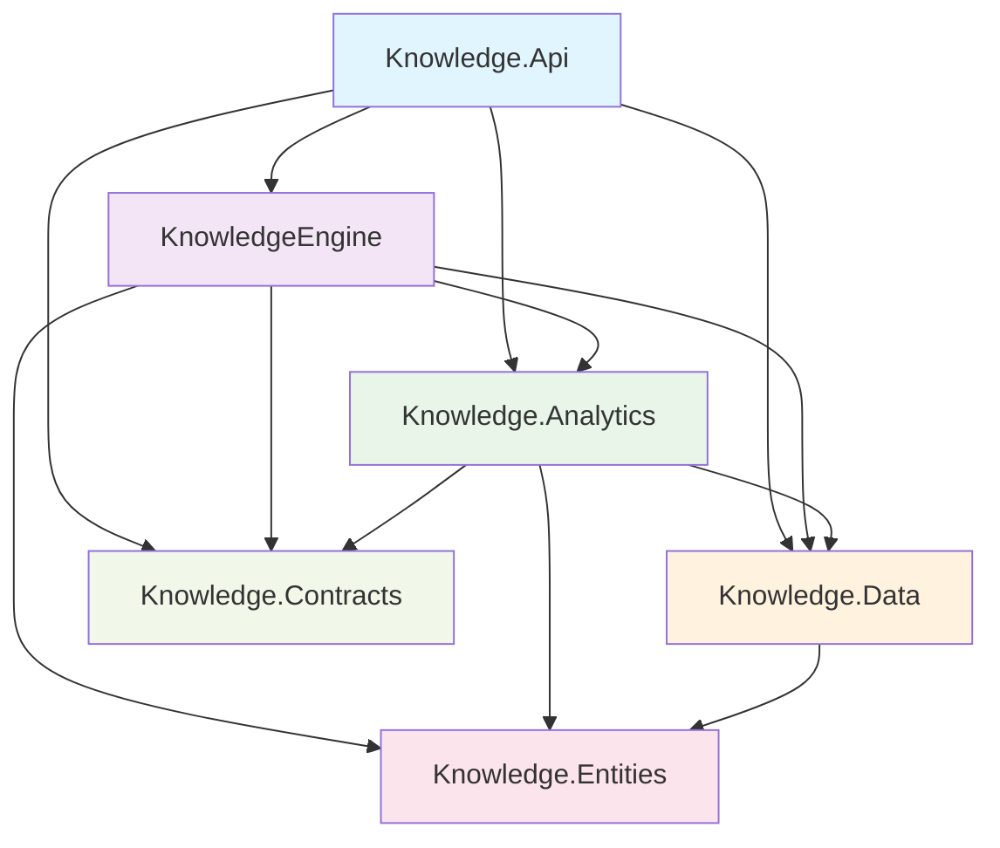
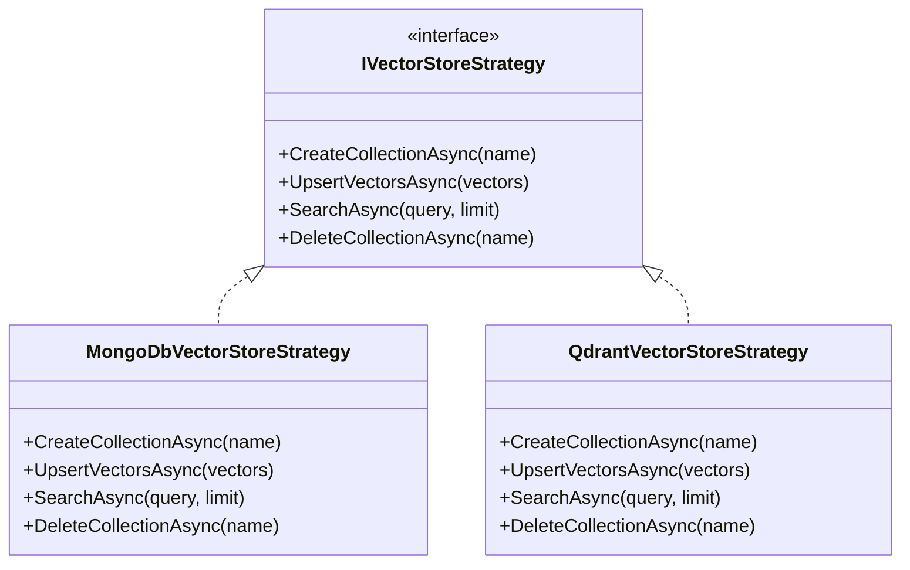
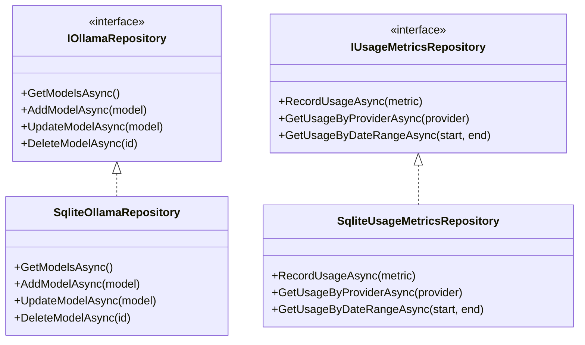
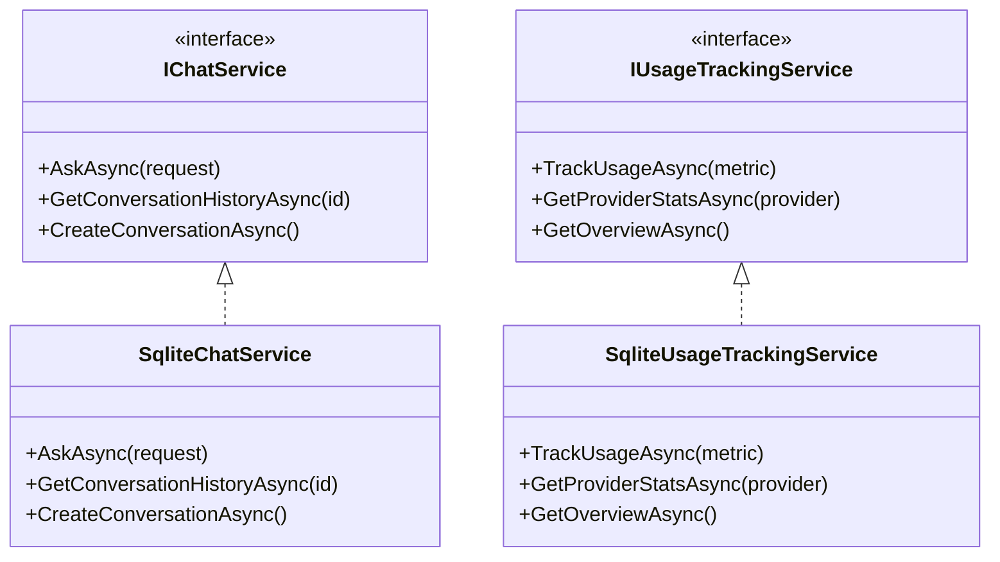
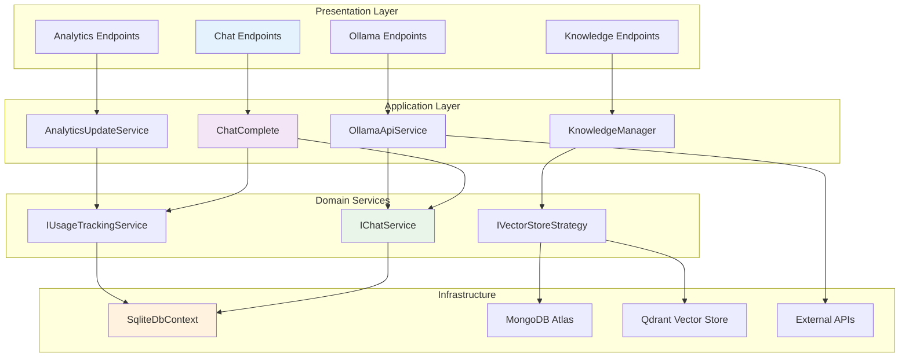
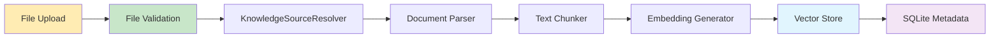
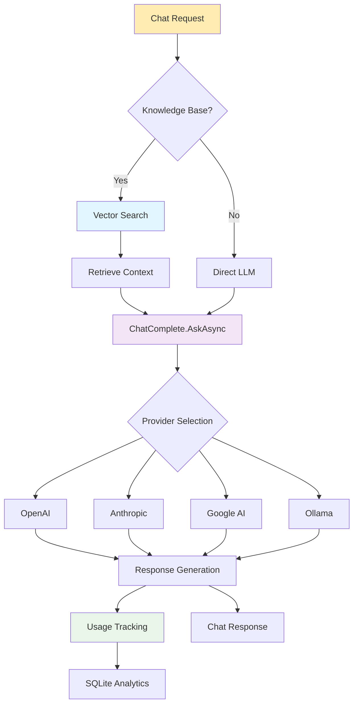
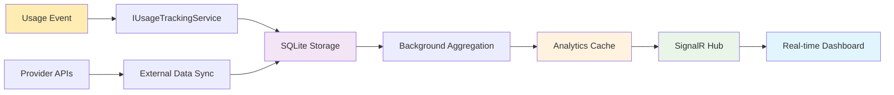
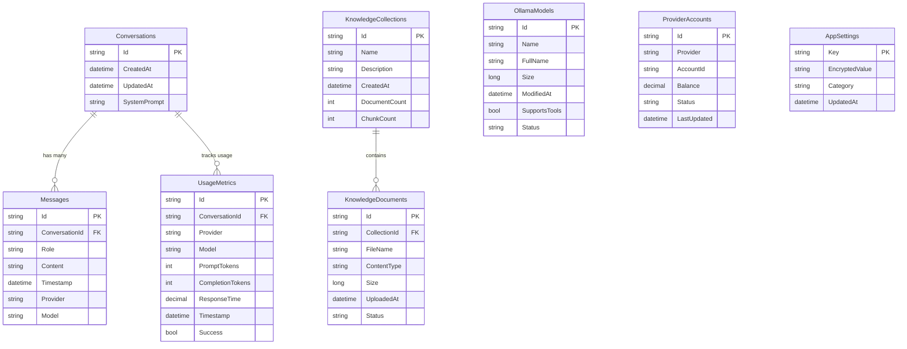

# AI Knowledge Manager - Backend Architecture Analysis

## Executive Summary

The AI Knowledge Manager is a sophisticated C# backend system built on .NET 8 that provides RAG (Retrieval-Augmented Generation) capabilities with multi-provider LLM support. The system features a clean layered architecture with comprehensive analytics, vector search capabilities, and support for both MongoDB Atlas and Qdrant vector stores with SQLite for local configuration management.

## Project Structure Overview

### Core Backend Projects

1. **Knowledge.Api** - ASP.NET Core Web API (Entry Point)
2. **KnowledgeEngine** - Core business logic and AI integration
3. **Knowledge.Analytics** - Analytics and usage tracking services
4. **Knowledge.Data** - Data access layer with SQLite support
5. **Knowledge.Entities** - Entity models and data structures
6. **Knowledge.Contracts** - DTOs and shared contracts

### Project Dependencies Diagram

## Technology Stack

### Core Technologies
- **.NET 8** - Runtime and framework
- **ASP.NET Core** - Web API framework
- **Minimal APIs** - HTTP endpoint definitions
- **SQLite** - Local database for metadata and configuration
- **MongoDB Atlas** - Vector store option with semantic search
- **Qdrant** - Alternative vector store with high-performance search

### AI & ML Libraries
- **Microsoft Semantic Kernel 1.64** - AI orchestration framework
- **Microsoft.Extensions.AI** - Modern embedding services
- **OpenAI.dll** - OpenAI GPT integration
- **Google.AI connectors** - Gemini model support
- **Anthropic connectors** - Claude model integration
- **Ollama connectors** - Local model support

### Infrastructure
- **Serilog** - Structured logging
- **SignalR** - Real-time WebSocket communication
- **Swashbuckle/OpenAPI** - API documentation
- **Docker** - Containerization support
- **Refit** - HTTP client library

## Architectural Patterns

### 1. Clean Architecture
- **Presentation Layer**: API controllers and endpoints
- **Application Layer**: Business logic in KnowledgeEngine
- **Infrastructure Layer**: Data access and external services
- **Domain Layer**: Entities and contracts

### 2. Strategy Pattern - Vector Store Abstraction

### 3. Repository Pattern - Data Access Layer

### 4. Service Layer Pattern - Business Logic

### System Component Interaction

## Core Classes Analysis

### Knowledge.Api Layer

#### Main Entry Point
- **Program.cs**: Application bootstrapping, DI configuration, middleware pipeline
- **Endpoints/**:
  - `ChatEndpoints.cs`: Chat API endpoints
  - `KnowledgeEndpoints.cs`: Document management endpoints
  - `AnalyticsEndpoints.cs`: Usage analytics endpoints
  - `OllamaEndpoints.cs`: Ollama model management
  - `HealthEndpoints.cs`: Health check endpoints

#### Services
- **KnowledgeIngestService.cs**: Document upload and processing
- **OllamaApiService.cs**: Ollama local model integration
- **OllamaDownloadService.cs**: Model download orchestration
- **AnalyticsUpdateService.cs**: Real-time analytics updates

#### Infrastructure
- **ValidationFilter.cs**: Input validation middleware
- **PythonCodeSampleFilter.cs**: Swagger documentation enhancement
- **AnalyticsHub.cs**: SignalR real-time communication hub

### KnowledgeEngine Layer

#### Core Orchestration
- **ChatComplete.cs**: Main AI chat orchestration with multi-provider support
- **KnowledgeManager.cs**: Document ingestion and vector search coordination
- **KernelFactory.cs**: Semantic Kernel configuration factory

#### Document Processing
- **Document/** namespace:
  - `Document.cs`: Document representation
  - `KnowledgeSourceResolver.cs`: File type resolution
  - `DocxToDocumentConverter.cs`: DOCX processing
  - `MarkdownToDocumentConverter.cs`: Markdown processing
  - `PDFKnowledgeSource.cs`: PDF text extraction
  - Interface contracts for extensible document processing

#### Chat Services
- **IChatService**: Chat service abstraction
- **MongoChatService.cs**: MongoDB-backed chat with conversation persistence
- **SqliteChatService.cs**: SQLite-backed chat for Qdrant deployments

#### Agent Framework
- **Agents/Plugins/CrossKnowledgeSearchPlugin.cs**: Multi-knowledge base search
- **Agents/Models/**: Agent response models and tool execution tracking

#### Persistence Layer
- **IVectorStoreStrategy**: Vector store abstraction
- **MongoDbVectorStoreStrategy**: MongoDB Atlas vector operations
- **QdrantVectorStoreStrategy**: Qdrant vector operations
- **IndexManagers/**: Search index management
- **Repositories/**: Data access implementations

### Knowledge.Data Layer

#### Database Context
- **SqliteDbContext.cs**: SQLite connection management and schema initialization
- Comprehensive database schema with WAL mode for concurrency
- Automatic migration support

#### Repository Implementations
- **SqliteOllamaRepository.cs**: Ollama model metadata management
- **SqliteUsageMetricsRepository.cs**: Usage analytics persistence
- **SqliteProviderAccountRepository.cs**: Provider account tracking

#### Data Access Interfaces
- **IOllamaRepository**: Model management operations
- **IUsageMetricsRepository**: Analytics data access
- **IProviderAccountRepository**: Provider configuration management

### Knowledge.Analytics Layer

#### Core Analytics Services
- **SqliteUsageTrackingService.cs**: Usage metrics collection
- **ProviderAggregationService.cs**: Cross-provider analytics aggregation
- **CachedAnalyticsService.cs**: Performance-optimized analytics with caching

#### Provider Integration
- **OpenAIProviderApiService.cs**: OpenAI billing API integration
- **AnthropicProviderApiService.cs**: Anthropic usage API integration
- **GoogleAIProviderApiService.cs**: Google AI usage tracking
- **OllamaProviderApiService.cs**: Local Ollama analytics

#### Performance & Reliability
- **AnalyticsCacheService.cs**: Redis-like caching for analytics
- **ProviderApiRateLimiter.cs**: API rate limiting and retry logic
- **BackgroundSyncService.cs**: Asynchronous data synchronization

### Knowledge.Entities Layer

#### Data Models
- **ConversationRecord.cs**: Chat conversation metadata
- **KnowledgeRecord.cs**: Document and collection metadata
- **UsageMetricRecord.cs**: Usage tracking data model
- **OllamaModelRecord.cs**: Local model metadata
- **ProviderAccountRecord.cs**: Provider account information
- **AppSettingRecord.cs**: Encrypted configuration storage

### Knowledge.Contracts Layer

#### Request/Response DTOs
- **ChatRequestDto.cs**: Chat API request contract
- **ChatResponseDto.cs**: Chat API response contract
- **KnowledgeSummaryDto.cs**: Knowledge collection summary
- **CreateKnowledgeResponseDto.cs**: Document upload response
- **HealthCheckDto.cs**: Health check response

#### Enumerations
- **AiProvider.cs**: Supported AI provider enumeration (OpenAI, Google, Anthropic, Ollama)

## Data Flow Architecture

### Document Ingestion Flow

### Chat Processing Flow

### Real-time Analytics Flow

## Database Schema

### SQLite Database Schema

### Vector Store Integration
- **MongoDB Atlas**: Collections with vector search indexes
- **Qdrant**: Collections with cosine similarity search
- **Metadata synchronization**: SQLite tracks vector store operations

## API Endpoint Structure

### Core Endpoints
- `POST /api/chat` - Chat with AI models
- `POST /api/knowledge` - Upload documents
- `GET /api/knowledge` - List collections
- `DELETE /api/knowledge/{id}` - Delete collections

### Ollama Management
- `GET /api/ollama/models` - List available models
- `POST /api/ollama/models/{name}/pull` - Download model
- `DELETE /api/ollama/models/{name}` - Remove model
- `GET /api/ollama/models/details` - Model details with auto-sync

### Analytics
- `GET /api/analytics/overview` - Usage overview
- `GET /api/analytics/providers` - Provider statistics
- `GET /api/analytics/knowledge` - Knowledge base analytics
- **SignalR**: `/api/analytics/hub` - Real-time updates

### Health & Monitoring
- `GET /api/health` - Application health
- `GET /api/health/detailed` - Detailed component health

## Advanced Features

### 1. Agent Framework
- **Tool Calling**: Automatic function invocation through Semantic Kernel
- **Cross-Knowledge Search**: Search across multiple knowledge bases
- **Dynamic Tool Support Detection**: Automatic detection of model tool capabilities
- **Graceful Degradation**: Fallback to traditional chat when agent features fail

### 2. Multi-Provider Support
- **Provider Abstraction**: Unified interface for OpenAI, Google, Anthropic, Ollama
- **Dynamic Model Selection**: Runtime provider/model switching
- **Provider-Specific Configuration**: Customized settings per provider
- **Usage Tracking**: Per-provider analytics and billing integration

### 3. Vector Store Flexibility
- **Strategy Pattern Implementation**: Seamless switching between MongoDB and Qdrant
- **Metadata Synchronization**: SQLite tracking regardless of vector store
- **Performance Optimization**: Provider-specific search optimization
- **Schema Evolution**: Database migration support

### 4. Real-time Analytics
- **SignalR Integration**: WebSocket-based real-time updates
- **Caching Strategy**: Multi-layer caching for performance
- **Background Processing**: Asynchronous analytics computation
- **Rate Limiting**: Provider API protection

## Security & Configuration

### Encryption
- **Symmetric Encryption**: AES-256 for sensitive configuration
- **Key Derivation**: PBKDF2 for secure key generation
- **Secure Storage**: Encrypted database fields for API keys

### Configuration Management
- **Zero-Dependency Deployment**: Self-contained SQLite configuration
- **Environment Variables**: External API key injection
- **Hot Configuration**: Runtime configuration updates
- **Default Initialization**: Automatic setup on first run

## Performance Considerations

### Database Optimization
- **WAL Mode**: SQLite Write-Ahead Logging for concurrency
- **Connection Pooling**: Efficient database connection management  
- **Indexing Strategy**: Optimized indexes for common queries
- **Prepared Statements**: SQL injection prevention and performance

### Vector Search Performance
- **Embedding Caching**: Reuse of computed embeddings
- **Batch Operations**: Bulk vector operations
- **Index Management**: Automatic search index creation
- **Result Limiting**: Configurable search result limits

### API Performance
- **Streaming Responses**: Real-time chat streaming
- **Async Operations**: Non-blocking I/O throughout
- **Connection Reuse**: HTTP client connection pooling
- **Request Validation**: Early request validation

## Deployment Architecture

### Container Support
- **Multi-stage Builds**: Optimized Docker images
- **Container Networking**: Service-to-service communication
- **Volume Management**: Persistent data storage
- **Health Checks**: Container health monitoring

### Service Dependencies
- **Optional MongoDB**: Fallback to Qdrant + SQLite
- **Optional External Services**: Graceful degradation
- **Self-contained Mode**: Complete functionality with Ollama + Qdrant
- **Microservice Ready**: Independent service deployment

## Extension Points

### 1. New AI Providers
- Implement `IVectorStoreStrategy` 
- Add provider-specific execution settings
- Create provider API service for analytics
- Update `AiProvider` enumeration

### 2. New Document Types
- Implement `IKnowledgeSource`
- Add file type detection in `KnowledgeSourceResolver`
- Create document-specific parsers
- Update file validation

### 3. New Vector Stores
- Implement `IVectorStoreStrategy`
- Add connection configuration
- Implement search optimization
- Add health check integration

### 4. Analytics Extensions
- Implement `IProviderApiService` for new providers
- Extend `UsageMetric` model for additional tracking
- Add custom aggregation services
- Extend real-time dashboard

This architecture provides a solid foundation for a production-ready RAG system with excellent extensibility, performance, and reliability characteristics. The clean separation of concerns, comprehensive testing support, and modern architectural patterns make it suitable for both development and enterprise deployment scenarios.